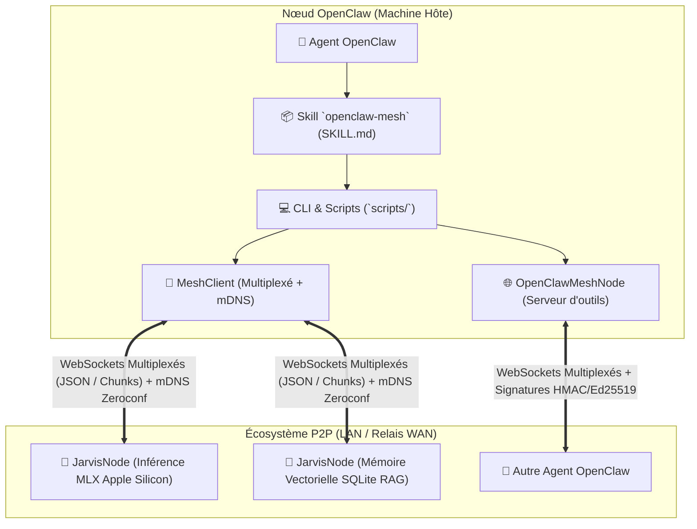

# 🌐 OpenClawMesh — Skill P2P & Protocole Décentralisé pour OpenClaw

[🇬🇧 Read in English](README.md) | [🇫🇷 Lire en Français](README.fr.md) | [📜 Spécification du Protocole](references/PROTOCOL_SPEC.md) | [🔐 Modèle de Sécurité](references/SECURITY_MODEL.md)

[](LICENSE)
[](https://www.python.org/downloads/)
[](SKILL.md)
[](#-compatibilité-jarvismesh)

**OpenClawMesh** est une compétence (Skill) et une bibliothèque réseau pair-à-pair (P2P) permettant à l'agent **OpenClaw** de collaborer nativement et en temps réel avec d'autres agents d'intelligence artificielle distribués sur le réseau local (LAN) ou distant, en s'appuyant rigoureusement sur le **Protocole JarvisMesh 1.0**.

---

## 🏛️ Architecture



---

## ✨ Fonctionnalités Clés

1. **Découverte Automatique Zero-Conf (mDNS)** :
   - Découvre automatiquement tous les nœuds JarvisMesh (`_jarvismesh._tcp.local.`) et OpenClaw (`_openclawmesh._tcp.local.`).
   - Introspection dynamique des compétences via la compétence interne réservée `_describe_skills`.

2. **Délégation & Inférence IA Multi-Matériels Universelle** :
   - **NVIDIA GPUs** : Accélération native CUDA / TensorRT / PyTorch.
   - **AMD GPUs** : Accélération ROCm / DirectML / HIP.
   - **Intel Core Ultra & Arc** : Accélération Intel NPU, OpenVINO, oneAPI et AVX-512.
   - **Apple Silicon** : Inférence GPU Metal ultra-rapide via MLX-LM.
   - **CPU Universel & Serveurs Locaux** : Fallback automatique optimisé (Ollama, llama.cpp, vLLM).
   - Commande de diagnostic matériel : `openclaw-mesh hardware`.

3. **Streaming Temps Réel Token-par-Token** :
   - Réception et émission fluide des flux de tokens sans blocage grâce aux trames `task_chunk`.

4. **Double Sécurité Cryptographique (Zero-Trust)** :
   - **Mode PSK** : Signature HMAC-SHA256 pré-partagée.
   - **Mode Asymétrique Ed25519** : Signature par clé privée avec vérification de clé publique et protection anti-rejeu par horodatage.

5. **Exposition des Outils OpenClaw** :
   - Exécute un serveur léger permettant aux autres agents du maillage d'appeler les outils de votre environnement OpenClaw.

6. **Passerelle de Monétisation & Facturation (Stripe / Revolut)** :
   - Système clé en main de vente de clés d'API (`openclaw_mesh/gateway`).
   - Webhooks automatisés (Stripe / Lemon Squeezy) avec virements vers votre IBAN **Revolut**.
   - Portail web client (`/portal`) et playground de test en direct.
   - Voir le [💳 Guide de Monétisation](MONETIZATION_GUIDE.md).

---

## 🚀 Installation & Utilisation

### 1. Installation du Skill
```bash
cd /Users/selim/Desktop/OpenClawMesh
pip install -e ".[dev]"
```

Pour installer le skill directement dans le dossier des skills OpenClaw :
```bash
mkdir -p ~/.openclaw/skills
ln -s /Users/selim/Desktop/OpenClawMesh ~/.openclaw/skills/openclaw-mesh
```

---

## 💻 Commandes CLI (`openclaw-mesh` / `scripts/mesh_cli.py`)

### 🔍 1. Découvrir les pairs actifs
```bash
python3 scripts/mesh_cli.py discover --inspect
```
Sortie JSON brute pour l'agent :
```bash
python3 scripts/mesh_discover.py
```

### ⚡ 2. Déléguer une tâche
```bash
# Routage automatique vers le meilleur pair
python3 scripts/mesh_cli.py call --skill llm --payload '{"prompt": "Écris un script Python de benchmark."}'

# Ciblage d'un pair spécifique
python3 scripts/mesh_cli.py call --peer mac-m3 --skill memory_search --payload '{"query": "Metal GPU", "top_k": 3}'
```

### 🌊 3. Consommer un LLM en streaming continu
```bash
python3 scripts/mesh_cli.py stream --skill llm_stream --payload '{"prompt": "Explique le protocole P2P."}'
```

### 🩺 4. Vérifier la santé et latence d'un pair
```bash
python3 scripts/mesh_cli.py ping --peer mac-m3
```

### 🌐 5. Lancer un nœud OpenClaw sur le maillage
```bash
python3 scripts/mesh_cli.py serve --name openclaw-mac --port 8770
```

### 🔑 6. Générer une identité Ed25519
```bash
python3 scripts/mesh_cli.py keygen --out node_id.key
```

---

## 🧪 Exécution des Tests

```bash
PYTHONPATH=. pytest -v tests/
```

La suite de tests vérifie :
- La sérialisation conforme des messages (`TaskRequest`, `TaskChunk`, `TaskResponse`).
- La signature et vérification HMAC-SHA256 et Ed25519.
- Le cycle de communication Client/Serveur asynchrone et streaming.
- L'interopérabilité directe et bidirectionnelle avec le code source de **JarvisMesh**.

---

## 📄 Licence
Ce projet est distribué sous licence MIT.
