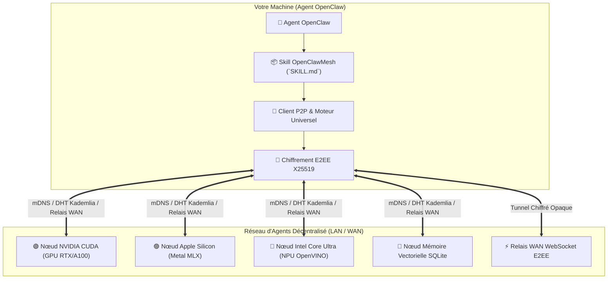

# 🌐 OpenClawMesh — Protocole d'Agents IA Décentralisé & Inférence Multi-Matériels

[🇬🇧 Read in English](README.md) | [🇫🇷 Lire en Français](README.fr.md) | [📜 Spécification du Protocole](references/PROTOCOL_SPEC.md) | [📄 Licence MIT](LICENSE.fr)

[](LICENSE)
[](https://www.python.org/downloads/)
[](SKILL.md)
[](#-interopérabilité-jarvismesh)
[](#-accélération-matérielle-universelle)

**OpenClawMesh** est une compétence (Skill) et un protocole réseau pair-à-pair (P2P) souverain pour agents d'intelligence artificielle.

Il permet à vos agents **OpenClaw** de se découvrir mutuellement sur le réseau local et sur Internet (WAN), de déléguer des calculs lourds, d'exploiter la puissance des puces graphiques, de router des flux chiffrés de bout en bout et d'accéder à une mémoire vectorielle partagée sans dépendre d'un cloud centralisé propriétaire.

---

## ✨ Fonctionnalités Clés

1. 📡 **Découverte P2P LAN (mDNS) & DHT Kademlia WAN (160-bit)** :
   - Détection automatique sur le réseau local via mDNS Zeroconf.
   - Routage décentralisé à grande échelle via table de hachage distribuée **Kademlia 160-bit** avec $k$-buckets ($k=20$).

2. ⚡ **Inférence IA Multi-Matériels & Auto-Quantification** :
   - 🟢 **NVIDIA GPUs** : Accélération native CUDA / TensorRT / PyTorch.
   - 🔴 **AMD GPUs** : Accélération ROCm / DirectML / HIP.
   - 🔵 **Intel Core Ultra & Arc** : Accélération Intel NPU, OpenVINO, oneAPI et AVX-512.
   - 🟣 **Apple Silicon (M1/M2/M3/M4)** : Inférence GPU Metal haute performance via MLX-LM.
   - ⚪ **CPU Universel & Serveurs Locaux** : Fallback automatique optimisé (Ollama, llama.cpp, vLLM).
   - **Auto-Quantification VRAM** : Sélection automatique du meilleur modèle et format (4-bit, 8-bit, FP16) selon la mémoire disponible.

3. 🔀 **Parallélisme par Pipeline & MoE Distribué** :
   - Découpage et exécution de très grands modèles (LLM / MoE) en étapes séquentielles à travers plusieurs machines du maillage.

4. 👁️ **Moteur Multi-Modal Natif** :
   - **Vision VLM** : Analyse d'images, OCR et raisonnement visuel (Qwen2-VL / Pixtral).
   - **Speech-to-Text (STT)** : Transcription audio multilingue Whisper.
   - **Text-to-Speech (TTS)** : Synthèse vocale haute fidélité.

5. 🔐 **Sécurité Zero-Trust & Chiffrement E2EE** :
   - Chiffrement de Bout en Bout (**ChaCha20-Poly1305 AEAD & X25519 ECDH**) : les relais WAN ne peuvent jamais lire les données en clair.
   - Signatures cryptographiques **Ed25519**, liste blanche `TrustStore` et protection anti-rejeu.

6. 🌐 **Traversée NAT (STUN) & Relais WAN WebSocket** :
   - Détection automatique de l'IP publique et franchissement des pare-feux pour relier des machines distantes sur Internet.

---

## 🏛️ Architecture



---

## 🚀 Installation Rapide

```bash
# 1. Cloner le dépôt
git clone https://github.com/samajesteduroyaume/OpenClawMesh.git
cd OpenClawMesh

# 2. Installer le package et ses dépendances
pip install -e .

# 3. Lier le Skill à votre installation OpenClaw
mkdir -p ~/.openclaw/skills
ln -s "$(pwd)" ~/.openclaw/skills/openclaw-mesh
```

---

## 💻 Guide d'Utilisation en Ligne de Commande (CLI)

### 1. 🔍 Diagnostiquer votre matériel IA & VRAM
```bash
python3 scripts/mesh_cli.py hardware
```

### 2. 📡 Découvrir les agents sur le réseau
```bash
python3 scripts/mesh_cli.py discover --inspect
```

### 3. 💬 Déléguer une tâche en streaming
```bash
python3 scripts/mesh_cli.py stream --skill llm_stream --payload '{"prompt": "Explique l'informatique quantique en 2 phrases."}'
```

### 4. 🗺️ Publier ou rechercher une compétence dans la DHT Kademlia
```bash
# Publier une compétence sur le réseau décentralisé
python3 scripts/mesh_cli.py dht --advertise llm

# Rechercher l'adresse d'un nœud fournissant la compétence
python3 scripts/mesh_cli.py dht --lookup llm
```

### 5. ⚡ Lancer un Relais WAN WebSocket (Traversée NAT)
```bash
python3 scripts/mesh_cli.py relay --port 8790
```

### 6. 👁️ Exécuter des tâches Multi-Modales (Vision, STT, TTS)
```bash
# Analyse d'image Vision VLM
python3 scripts/mesh_cli.py multimodal --task vision --prompt "Analyse cette interface graphique."

# Synthèse vocale TTS
python3 scripts/mesh_cli.py multimodal --task tts --prompt "Bonjour, agent OpenClaw connecté au maillage."
```

### 7. 🌐 Exposer votre machine comme nœud du réseau
```bash
python3 scripts/mesh_cli.py serve --name mon-agent --port 8770
```

---

## 💳 Offres & Licences d'Accès

| Offre | Tarif | Modalité | Description |
| :--- | :---: | :---: | :--- |
| 🆓 **Découverte** | **0 €** | Gratuit | 3 requêtes de test par jour pour évaluer la compétence. |
| ⚡ **Pro Mensuel** | **10 € / mois** | Abonnement | Requêtes illimitées, inférence accélérée GPU/NPU et RAG. |
| 👑 **Licence à Vie** | **200 €** | **Paiement Unique** | **Accès illimité permanent sans abonnement**, toutes futures mises à jour incluses et support prioritaire VIP. |

### Configuration de votre Clé d'Accès :
```bash
export OPENCLAW_API_KEY="sk_claw_..."
```

---

## 🧪 Exécution des Tests

```bash
PYTHONPATH=. pytest -v tests/
```
> Suite de **35 tests automatisés** validant le protocole P2P, le DHT Kademlia, le chiffrement E2EE, le relais WAN, l'auto-quantification VRAM et le multi-modal.

---

## 📄 Licence

La bibliothèque cliente OpenClawMesh et le protocole P2P sont distribués sous licence open-source **MIT**.
L'accès aux clusters managés d'inférence GPU multi-matériels et aux relais officiels fait l'objet d'offres commerciales (**Pro à 10€/mois** ou **Licence à Vie à 200€**).
- Voir [LICENSE](LICENSE) (version anglaise officielle) ou [LICENSE.fr](LICENSE.fr) (version française).
