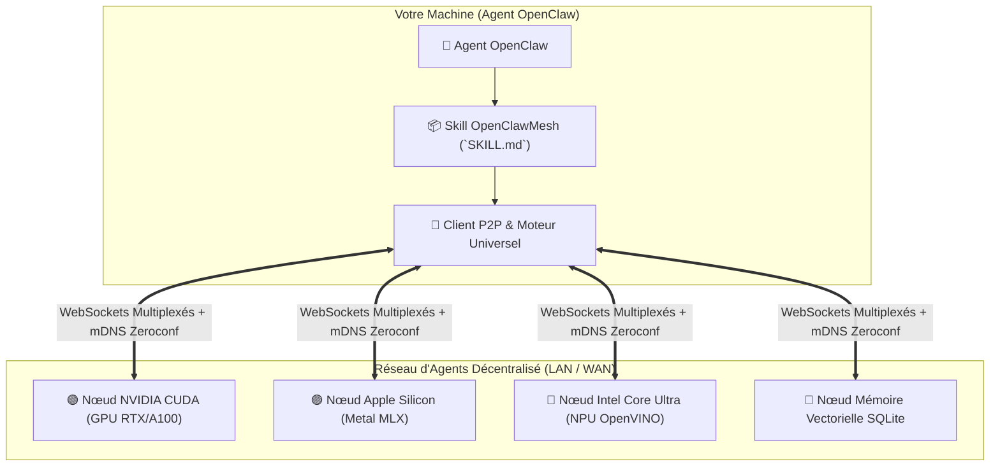

# 🌐 OpenClawMesh — Protocole d'Agents IA Décentralisé & Inférence Multi-Matériels

[🇬🇧 Read in English](README.md) | [🇫🇷 Lire en Français](README.fr.md) | [📜 Spécification du Protocole](references/PROTOCOL_SPEC.md) | [📄 Licence Commerciale](LICENSE.fr)

[](LICENSE)
[](https://www.python.org/downloads/)
[](SKILL.md)
[](#-interopérabilité-jarvismesh)
[](#-accélération-matérielle-universelle)

**OpenClawMesh** est une compétence (Skill) et un protocole réseau pair-à-pair (P2P) souverain pour agents d'intelligence artificielle.

Il permet à vos agents **OpenClaw** de se découvrir mutuellement sur le réseau local, de déléguer des calculs lourds, d'exploiter la puissance des puces graphiques et d'accéder à une mémoire vectorielle partagée sans dépendre d'un cloud centralisé propriétaire.

---

## ✨ Fonctionnalités Clés

1. 📡 **Découverte P2P Zero-Configuration (mDNS)** :
   - Détection automatique et instantanée des agents et nœuds disponibles sur votre réseau local (LAN) et relais WAN.
   - Introspection dynamique des capacités de chaque agent via `_describe_skills`.

2. ⚡ **Inférence IA Multi-Matériels Universelle** :
   - 🟢 **NVIDIA GPUs** : Accélération native CUDA / TensorRT / PyTorch.
   - 🔴 **AMD GPUs** : Accélération ROCm / DirectML / HIP.
   - 🔵 **Intel Core Ultra & Arc** : Accélération Intel NPU, OpenVINO, oneAPI et AVX-512.
   - 🟣 **Apple Silicon (M1/M2/M3/M4)** : Inférence GPU Metal haute performance via MLX-LM.
   - ⚪ **CPU Universel & Serveurs Locaux** : Fallback automatique optimisé (Ollama, llama.cpp, vLLM).

3. 🌊 **Streaming Temps Réel Token-par-Token** :
   - Émission et réception ultra-fluides des flux de génération LLM sans latence bloquante via trames `task_chunk`.

4. 🧠 **Mémoire Vectorielle Persistante & RAG SQLite** :
   - Stockage épisodique, recherche sémantique cosinus et conservation du contexte conversationnel entre sessions.

5. 🔐 **Sécurité Asymétrique Zero-Trust** :
   - Signatures cryptographiques **Ed25519**, liste blanche `TrustStore`, horodatage anti-rejeu et support HMAC-SHA256.

---

## 🏛️ Architecture



---

## 🚀 Installation Rapide

```bash
# 1. Cloner le dépôt
git clone https://github.com/samajesteduroyaume/OpenClawMesh.git
cd OpenClawMesh

# 2. Installer le package et ses dépendances
pip install -e .

# 3. Lier le Skill à votre installation OpenClaw
mkdir -p ~/.openclaw/skills
ln -s "$(pwd)" ~/.openclaw/skills/openclaw-mesh
```

---

## 💻 Guide d'Utilisation en Ligne de Commande (CLI)

### 1. 🔍 Diagnostiquer votre matériel IA
Identifiez instantanément l'accélérateur matériel disponible sur votre machine :
```bash
python3 scripts/mesh_cli.py hardware
```

### 2. 📡 Découvrir les agents sur le réseau
Scannez le réseau local pour lister les nœuds actifs et leurs compétences :
```bash
python3 scripts/mesh_cli.py discover --inspect
```

### 3. 💬 Déléguer une tâche en streaming
Envoyez un prompt à un nœud d'inférence avec affichage continu token-par-token :
```bash
python3 scripts/mesh_cli.py stream --skill llm_stream --payload '{"prompt": "Explique l'informatique quantique en 2 phrases."}'
```

### 4. 💾 Interroger la mémoire vectorielle
Effectuez une recherche sémantique sur la mémoire du maillage :
```bash
python3 scripts/mesh_cli.py call --skill memory_search --payload '{"query": "architecture P2P", "top_k": 3}'
```

### 5. 🌐 Exposer votre machine comme nœud du réseau
Partagez les outils de votre machine avec les autres agents du maillage :
```bash
python3 scripts/mesh_cli.py serve --name mon-agent --port 8770
```

---

## 💳 Offres & Licences d'Accès

OpenClawMesh propose des options d'accès flexibles adaptées à tous les usages :

| Offre | Tarif | Modalité | Description |
| :--- | :---: | :---: | :--- |
| 🆓 **Découverte** | **0 €** | Gratuit | 3 requêtes de test par jour pour évaluer la compétence. |
| ⚡ **Pro Mensuel** | **10 € / mois** | Abonnement | Requêtes illimitées, inférence accélérée GPU/NPU et RAG. |
| 👑 **Licence à Vie** | **200 €** | **Paiement Unique** | **Accès illimité permanent sans abonnement**, toutes futures mises à jour incluses et support prioritaire VIP. |

### Configuration de votre Clé d'Accès :
Une fois votre clé obtenue sur le portail client :
```bash
export OPENCLAW_API_KEY="sk_claw_..."
```

---

## 🧪 Exécution des Tests

La suite de tests vérifie l'ensemble du réseau P2P, la cryptographie et l'interopérabilité matérielle :
```bash
PYTHONPATH=. pytest -v tests/
```

---

## 📄 Licence

Distribué sous la licence **OpenClawMesh Commercial & Evaluation License**.
- Gratuit pour usage personnel et évaluation.
- L'usage commercial et l'accès à la passerelle multi-matériels requièrent une licence active (**Pro à 10€/mois** ou **Licence à Vie à 200€**).
- Voir [LICENSE](LICENSE) (version anglaise officielle) ou [LICENSE.fr](LICENSE.fr) (version française).
