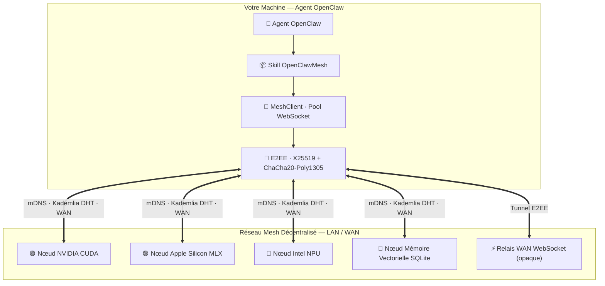

<div align="center">


# ⚡ OpenClawMesh

### Protocole P2P Décentralisé pour Agents IA · Inférence Multi-Matériels Universelle · Bitcoin Natif

[🇬🇧 Read in English](README.md) · [📐 Architecture](ARCHITECTURE.md) · [📜 Protocole](references/PROTOCOL_SPEC.md) · [🌐 Portail Passerelle](http://localhost:8000)

---

[](LICENSE.fr)
[](https://www.python.org/)
[](LICENSE.fr)
[](#-compatibilité-jarvismesh)
[](#-tests)
[](#-accélération-matérielle-universelle)

</div>

---

**OpenClawMesh** est un protocole pair-à-pair souverain et un Skill modulaire pour les agents IA **OpenClaw**. La connectivité LAN est le cas par défaut ; les fonctions WAN (DHT, relais et STUN) sont optionnelles et doivent être activées séparément.

Les agents se découvrent sur le réseau local et Internet, délèguent du calcul, exploitent les GPU/NPU locaux, routent des charges utiles chiffrées de bout en bout et partagent une mémoire vectorielle persistante — **sans dépendre d'aucun prestataire cloud centralisé**.
Les paiements pour la passerelle managée sont **exclusivement en Bitcoin** — pas de compte, pas de KYC, pas de banque.

> ⚠️ **Périmètre :** la passerelle de monétisation est un composant optionnel, inutile pour la connectivité mesh. Elle traite des métadonnées de paiement et des identifiants API. L'oracle de prix BTC externe est désactivé par défaut ; son activation envoie des requêtes au fournisseur configuré. Isolez et examinez ce composant avant toute exposition.

> ⚠️ **Avertissement sécurité :** la découverte mDNS et le relais WAN sont désactivés par défaut. Leur activation rend le nœud détectable et peut transmettre des invites, fichiers, résultats ou métadonnées à des pairs distants. N'exposez jamais un nœud sans TLS et authentification (PSK ou `TrustStore`), et n'activez une compétence distante qu'après vérification de sa liste blanche.

---

## ✨ Fonctionnalités

<table>
<tr>
<td width="50%">

**🌐 Découverte Double Couche**
- LAN sans configuration via **mDNS Zeroconf** (double type de service : JarvisMesh & OpenClawMesh)
- WAN mondial via **DHT Kademlia 160-bit** (UDP réel, *k*=20, α=3, lookups itératifs), uniquement après activation explicite

**⚡ Moteur d'Inférence Universel**
- 🟢 **NVIDIA** — CUDA / TensorRT / PyTorch
- 🔴 **AMD** — ROCm / DirectML / HIP
- 🔵 **Intel Core Ultra** — NPU / OpenVINO / AVX-512
- 🟣 **Apple Silicon M1–M4** — Metal GPU via MLX-LM
- ⚪ **Fallback CPU** — Ollama / llama.cpp / vLLM

**🎯 Quantisation VRAM Automatique**
- Sélectionne le format optimal (4-bit, 8-bit, FP16) selon la VRAM disponible

</td>
<td width="50%">

**🔐 Sécurité Zéro-Confiance**
- **ChaCha20-Poly1305 AEAD** + **X25519 ECDH** — E2EE (les relais ne voient que le chiffré)
- Identités **Ed25519** + liste blanche `TrustStore`
- Anti-rejeu : fenêtre d'horodatage + cache de nonces borné

**🔀 Pipeline Distribué**
- Fragmentation de grands modèles LLM / MoE sur plusieurs nœuds
- **Streaming** natif (générateur async, token par token)

**👁️ IA Multi-Modale**
- Vision VLM (Qwen2-VL, Pixtral), STT (Whisper), TTS

**₿ Passerelle de Paiement Bitcoin**
- Sans Stripe, sans PayPal — **BTC on-chain** pur
- Vérification automatique désactivée par défaut ; activation explicite possible après confirmation on-chain
- Oracle BTC/EUR avec médiane multi-source en cache et taux fixé par paiement

</td>
</tr>
</table>

---

## 🏛️ Architecture



### Carte des Modules

| Couche | Module | Responsabilité |
|---|---|---|
| Transport | `node.py` · `client.py` | Serveur WebSocket + pool de connexions multiplexées |
| Protocole | `protocol.py` · `bridge.py` | Format wire JSON · SkillRegistry |
| Découverte | `discovery.py` · `network/dht.py` | mDNS + Kademlia 160-bit UDP |
| Sécurité | `crypto.py` · `crypto_e2ee.py` | Identité Ed25519 · X25519+ChaCha20 E2EE |
| Inférence | `engines/` | Détection matériel · MLX/CUDA/OpenVINO · MoE · Multimodal |
| Passerelle | `gateway/` | FastAPI · SQLite · Flux paiement Bitcoin · Portail web |
| Config | `config.py` | Pydantic Settings · singleton · piloté par l'environnement |

---

## 🚀 Installation Rapide

Avant de lancer un nœud, vérifiez les permissions réseau et les compétences exposées. L'installation ne déclenche pas de découverte LAN, et l'accès WAN doit être configuré explicitement avec TLS et authentification.

```bash
# Cloner & installer
git clone https://github.com/samajesteduroyaume/OpenClawMesh.git
cd OpenClawMesh
pip install -e ".[all]"

# Lier comme Skill OpenClaw
mkdir -p ~/.openclaw/skills
ln -s "$(pwd)" ~/.openclaw/skills/openclaw-mesh
```

**Extras minimaux :**
```bash
pip install -e "."          # WebSocket + mDNS seulement
pip install -e ".[crypto]"  # + Support Ed25519
pip install -e ".[rich]"    # + Affichage CLI Rich
pip install -e ".[all]"     # Tout inclus
```

---

## 💻 Référence CLI

```bash
# Diagnostiquer le matériel & VRAM
openclaw-mesh hardware

# Découvrir les pairs LAN
openclaw-mesh discover --timeout 5 --inspect

# Appeler une compétence sur un pair
openclaw-mesh call mon-nœud llm --payload '{"prompt": "Bonjour"}'

# Streaming de tokens en temps réel
openclaw-mesh stream mon-nœud llm --payload '{"prompt": "Écris un haïku"}'

# Démarrer ce machine comme nœud du mesh
openclaw-mesh serve --name mon-agent --port 8770 --psk monsecret

# Générer une identité Ed25519
openclaw-mesh keygen --output ~/.openclaw/identity.key

# DHT Kademlia — publier & découvrir
openclaw-mesh dht --advertise llm --bootstrap 192.0.2.5:8780
openclaw-mesh dht --lookup llm   --bootstrap 192.0.2.5:8780

# Démarrer un relais WAN WebSocket
openclaw-mesh relay --port 8790

# Inférence multi-modale
openclaw-mesh multimodal --task vision --prompt "Décris cette image."
openclaw-mesh multimodal --task tts    --prompt "Bienvenue sur OpenClawMesh."
```

---

## 🐍 SDK Python

```python
import asyncio
import os
from openclaw_mesh import OpenClawMeshNode, MeshClient, SkillRegistry

# ── Démarrer un nœud ──────────────────────────────────────────────────
registry = SkillRegistry(name="mon-nœud")


async def llm(payload: dict) -> dict:
    return {"text": f"Réponse : {payload.get('prompt')}", "model": "local"}


registry.register(llm, expose_remote=True)


async def servir():
    node = OpenClawMeshNode(
        name="mon-nœud", port=8770, psk=os.environ["OPENCLAW_PSK"], registry=registry
    )
    await node.start(enable_zeroconf=False)  # Activer uniquement après revue de l’exposition LAN.
    await asyncio.Event().wait()


# ── Appeler depuis un client ──────────────────────────────────────────
async def demo_client():
    client = MeshClient(
        name="orchestrateur", psk=os.environ["OPENCLAW_PSK"], enable_discovery=False
    )
    await client.start()
    await asyncio.sleep(3)  # Découverte mDNS

    # Appel direct
    resp = await client.call("mon-nœud", "llm", {"prompt": "Qu'est-ce que le P2P ?"})
    print(resp.result)

    # Routage automatique vers le meilleur pair
    resp = await client.delegate("llm", {"prompt": "Optimise ce code"})
    print(resp.result)

    # Streaming token par token
    await client.call_stream(
        "mon-nœud",
        "llm",
        {"prompt": "Raconte une histoire"},
        on_chunk=lambda c: print(c, end="", flush=True),
    )
    await client.stop()
```

---

## 🔐 Modèle de Sécurité

```
┌─────────────────────────────────────────────────────────────┐
│ Couche 3 — E2EE (optionnel, fortement recommandé sur WAN)   │
│  X25519 ECDH + HKDF-SHA256 + ChaCha20-Poly1305              │
│  Les relais ne déchiffrent jamais le contenu                 │
├─────────────────────────────────────────────────────────────┤
│ Couche 2 — Auth Ed25519 (optionnel)                         │
│  Identité par nœud · Liste blanche TrustStore · ±300s drift  │
├─────────────────────────────────────────────────────────────┤
│ Couche 1 — HMAC-SHA256 (optionnel, compat. JarvisMesh)      │
│  Clé pré-partagée · compare_digest (résistant timing attack) │
├─────────────────────────────────────────────────────────────┤
│ Couche 0 — Transport TLS (optionnel)                        │
│  Injecter ssl.SSLContext dans Node et Client                 │
└─────────────────────────────────────────────────────────────┘
```

```python
# Générer une identité de nœud
from openclaw_mesh import NodeIdentity

identity = NodeIdentity.generate()
identity.save("~/.openclaw/identity.key")
print(identity.public_key_hex)  # Partager avec les pairs de confiance

# Session E2EE
from openclaw_mesh import E2EESession

session = E2EESession()
session.establish_with_peer(peer_pubkey_bytes)
packet = session.encrypt({"secret": "payload"})
data = session.decrypt(packet)
```

---

## ₿ Passerelle de Paiement Bitcoin

> Auto-hébergez la passerelle ou utilisez le service managé — paiements Bitcoin uniquement, sans compte requis.

### Plans

| Plan | Prix | Durée | Accès |
|---|---|---|---|
| 🆓 **Démo Gratuite** | Gratuit | 7 jours | 3 appels API |
| ⚡ **Pro Mensuel** | ≈ 10 €/mois en BTC | 30 jours par paiement ; nouvelle clé lors du renouvellement | Sans quota numérique (limité par le débit et la capacité) |
| 👑 **Licence à Vie** | ≈ 200 € unique en BTC | À vie | Toutes MAJ futures · Support VIP |

**Adresse Bitcoin :** `bc1qwq8sll9vrl83lclyhha2gyncpd5275cdr2wul5`

Le service calcule le montant en satoshis avec le cours BTC/EUR de l'oracle au moment de la soumission. Le taux et le montant attendu sont ensuite figés pour ce paiement. Par défaut, une confirmation administrateur est nécessaire ; l'activation automatique après `BTC_REQUIRED_CONFIRMATIONS` confirmations n'a lieu que si `BTC_AUTO_VERIFY=true` est explicitement configuré. Chaque nouveau paiement confirmé crée une nouvelle clé. Le statut se consulte avec le `status_token` privé retourné lors de la soumission.

### Flux de Paiement

```bash
# 1. Obtenir les informations de paiement
curl http://localhost:8000/api/v1/payment/info

# 2. Envoyer BTC → soumettre votre txid
curl -X POST http://localhost:8000/api/v1/payment/submit \
  -H "Content-Type: application/json" \
  -d '{"email":"vous@exemple.com","plan":"pro_monthly","txid":"votre_txid_ici"}'
# → {"ok":true, "payment_id":"abc123...", "status_token":"...", "status":"pending_verification"}

# 3. Vérifier le statut avec le jeton privé retourné lors de la soumission
curl -H "X-Payment-Token: $STATUS_TOKEN" \
    http://localhost:8000/api/v1/payment/status/abc123

# 4. Utiliser votre clé
export OPENCLAW_API_KEY="sk_claw_..."
curl -X POST http://localhost:8000/api/v1/execute \
  -H "X-API-Key: $OPENCLAW_API_KEY" \
  -H "Content-Type: application/json" \
  -d '{"skill":"llm","payload":{"prompt":"Bonjour le monde"}}'
```

### Auto-Héberger la Passerelle

```bash
export GATEWAY_ADMIN_TOKEN="votre_token_admin_secret"
export BTC_WALLET_ADDRESS="bc1qwq8sll9vrl83lclyhha2gyncpd5275cdr2wul5"
export GATEWAY_DB_PATH="/data/openclaw_keys.db"

uvicorn openclaw_mesh.gateway.server:app --host 127.0.0.1 --port 8000
```

---

## 🧪 Tests

```bash
# Suite complète
pytest tests/ -v

# Avec couverture
pytest tests/ -v --cov=openclaw_mesh

# Module spécifique
pytest tests/test_e2ee.py -v
```

> **41 tests passants** — couvrant le réseau P2P, le DHT Kademlia, l'anti-rejeu E2EE, l'authentification d'identité, le relais WAN, la quantisation VRAM, les moteurs multi-modaux et le flux Bitcoin.

### Déploiement sécurisé

Copiez [.env.example](.env.example) vers `.env` et remplacez tous les placeholders.
En production, définissez un `GATEWAY_ADMIN_TOKEN` et un `OPENCLAW_PSK` aléatoires,
limitez `GATEWAY_CORS_ORIGINS` à votre frontend, utilisez HTTPS/WSS et conservez la
base SQLite dans un répertoire protégé. Le montant BTC est calculé par l'oracle au
moment de la soumission puis reste fixé pour le paiement. La clé est activée
automatiquement après `BTC_REQUIRED_CONFIRMATIONS` confirmations.

---

## 🔁 Compatibilité JarvisMesh

OpenClawMesh est **wire-compatible avec JarvisMesh 1.0** :
- Même format JSON (`type`, `skill`, `payload`, `request_id`, `origin`, `ts`, `sig`)
- Même base de signature HMAC-SHA256 (JSON trié canonique)
- Double enregistrement mDNS (`_jarvismesh._tcp.local.` + `_openclawmesh._tcp.local.`)

Les nœuds JarvisMesh peuvent appeler des nœuds OpenClawMesh et vice versa sans modification.

---

## ⚙️ Configuration

Tous les paramètres sont pilotés par des variables d'environnement (préfixe `OPENCLAW_`) :

```bash
OPENCLAW_NODE_NAME=mon-nœud-prod     # Nom du nœud (mDNS)
OPENCLAW_DEFAULT_PORT=8770           # Port WebSocket
OPENCLAW_PSK=votre_psk_secret        # Clé pré-partagée HMAC
OPENCLAW_E2EE_ENABLED=true           # Chiffrement de bout en bout
OPENCLAW_E2EE_REQUIRE_IDENTITY_BINDING=true # Identité E2EE obligatoire sur WAN
OPENCLAW_DHT_ENABLED=true            # Découverte WAN DHT Kademlia
OPENCLAW_MAX_ACTIVE_TASKS=100        # Limite de tâches simultanées
OPENCLAW_MAX_QUEUED_TASKS=200        # Limite de tâches en attente
OPENCLAW_MAX_OUTPUT_BYTES=2097152    # Limite des sorties distantes (2 MiB)
OPENCLAW_LOG_LEVEL=INFO              # DEBUG / INFO / WARNING
BTC_WALLET_ADDRESS=bc1q...           # Passerelle : adresse Bitcoin
GATEWAY_ADMIN_TOKEN=token_admin      # Passerelle : token admin API
GATEWAY_DB_PATH=/data/clés.db        # Passerelle : chemin SQLite
```

Référence complète : [`config.py`](openclaw_mesh/config.py) · [`ARCHITECTURE.md`](ARCHITECTURE.md)

### 🌐 Paramétrer et activer le WAN

#### 1. Préparer l’authentification

Un nœud exposé sur le réseau ne doit pas être anonyme. Configurez au minimum une
clé PSK partagée entre les pairs :

```bash
export OPENCLAW_PSK="remplacez-par-un-secret-long-et-aleatoire"
export OPENCLAW_E2EE_REQUIRE_IDENTITY_BINDING=true
```

Pour une gestion par identités, utilisez plutôt un TrustStore contenant les clés
Ed25519 autorisées :

```bash
export OPENCLAW_TRUST_STORE_PATH="$HOME/.config/openclaw-mesh/truststore.json"
```

Le mode E2EE strict nécessite alors une identité locale et la clé publique
attendue de chaque pair. Ne transmettez jamais la PSK dans un dépôt Git.

#### 2. Ouvrir le réseau

Le bouton WAN du portail démarre le nœud sur le port configuré par
`OPENCLAW_DEFAULT_PORT` (8770 par défaut).

- Sur le même ordinateur : aucune règle réseau n’est nécessaire.
- Sur un LAN : autorisez le port TCP du nœud dans le pare-feu local.
- Depuis Internet : redirigez ce port sur le routeur vers la machine OpenClaw,
    limitez les adresses sources lorsque c’est possible et utilisez WSS/TLS ou un
    relais WAN sécurisé.
- Pour la découverte DHT, autorisez également le port UDP configuré par
    `OPENCLAW_DHT_PORT` (8780 par défaut).

#### 3. Activer depuis le portail

1. Démarrez la passerelle :

     ```bash
     uvicorn openclaw_mesh.gateway.server:app --host 127.0.0.1 --port 8000
     ```

2. Ouvrez `http://127.0.0.1:8000/portal`.
3. Dans **Nœud WAN**, cochez **Autoriser l’accès distant WAN**.
4. Saisissez le jeton administrateur puis cliquez sur le bouton d’activation.

Le jeton est lu depuis `GATEWAY_ADMIN_TOKEN` ou généré automatiquement dans
`~/.config/openclaw-mesh/gateway_admin.token`. Le bouton reste local, mais
l’activation de l’exposition distante exige toujours ce jeton.

Pour désactiver le WAN, décochez l’option et cliquez à nouveau sur le bouton.
Le nœud est alors arrêté immédiatement.

#### 4. Vérifier la connexion

Depuis une autre machine autorisée, utilisez le nom ou l’adresse du pair avec
la même PSK :

```bash
openclaw-mesh call mon-agent echo \
    --payload '{"message":"connexion WAN OK"}' \
    --psk "$OPENCLAW_PSK"
```

Ne publiez pas le port WAN sans authentification. Le bouton refuse l’activation
si ni `OPENCLAW_PSK` ni `OPENCLAW_TRUST_STORE_PATH` ne sont configurés.

---

## 📁 Structure du Projet

```
OpenClawMesh/
├── openclaw_mesh/
│   ├── node.py            # Serveur WebSocket (dispatch skills, authentification)
│   ├── client.py          # Client WebSocket (pool de connexions, multiplexage)
│   ├── protocol.py        # Format wire JSON (TaskRequest/Chunk/Response)
│   ├── bridge.py          # SkillRegistry (support sync/async/générateur)
│   ├── crypto.py          # NodeIdentity Ed25519 & TrustStore
│   ├── crypto_e2ee.py     # Sessions E2EE X25519 + ChaCha20-Poly1305
│   ├── discovery.py       # Découverte LAN mDNS/Zeroconf
│   ├── config.py          # Pydantic Settings (singleton piloté par env)
│   ├── cli.py             # CLI argparse (11 commandes)
│   ├── engines/
│   │   ├── hardware.py        # Détection matériel universelle
│   │   ├── inference.py       # Moteur MLX / CUDA / OpenVINO / CPU
│   │   ├── model_manager.py   # Quantisation VRAM auto & sélection modèle
│   │   ├── distributed_moe.py # Pipeline MoE distribué entre nœuds
│   │   └── multimodal.py      # Vision / STT / TTS
│   ├── network/
│   │   ├── dht.py             # DHT Kademlia 160-bit (transport UDP réel)
│   │   ├── relay.py           # Relais WAN WebSocket (routage opaque)
│   │   └── nat_traversal.py   # STUN RFC 5389 traversée NAT
│   └── gateway/
│       ├── server.py          # Passerelle FastAPI (paiements BTC, gestion clés)
│       ├── db.py              # KeyDatabase SQLite (quotas, expiration, logs paiement)
│       └── portal.py          # Interface web (QR BTC, formulaire, playground)
├── tests/                 # 41 tests unitaires & d'intégration
├── ARCHITECTURE.md        # Documentation technique complète niveau ingénieur senior
├── SKILL.md               # Descripteur de Skill OpenClaw
├── LICENSE                # MIT + Addendum Services Commerciaux (EN)
├── LICENSE.fr             # MIT + Addendum Services Commerciaux (FR)
└── pyproject.toml
```

---

## 🤝 Contribution

```bash
git clone https://github.com/samajesteduroyaume/OpenClawMesh.git
cd OpenClawMesh
pip install -e ".[dev]"
pre-commit install

# Qualité de code (obligatoire avant PR)
ruff check openclaw_mesh/   # 0 erreur tolérée
black openclaw_mesh/ tests/
mypy openclaw_mesh/
pytest tests/ -v
```

**Conventions :**
- Type hints sur toutes les signatures publiques et protégées
- `raise X from e` dans tous les blocs except
- `asyncio.create_task()` plutôt que `ensure_future()`
- `asyncio.get_running_loop()` plutôt que `get_event_loop()`
- `logging.getLogger("openclaw_mesh.<module>")` — jamais `print()`

---

## 📄 Licence

**Cœur OpenClawMesh** (bibliothèque, protocole, CLI) — [Licence MIT](LICENSE.fr)

**Passerelle managée & relais hébergés** — Service commercial, Bitcoin uniquement :
- `bc1qwq8sll9vrl83lclyhha2gyncpd5275cdr2wul5`
- Conditions complètes : [LICENSE](LICENSE) (English) · [LICENSE.fr](LICENSE.fr) (Français)

---

<div align="center">

**OpenClawMesh © 2026 — IA Décentralisée · Calcul Souverain · Bitcoin Natif**

*Construit avec ⚡ pour les agents IA qui n'ont pas besoin de demander la permission*

</div>
