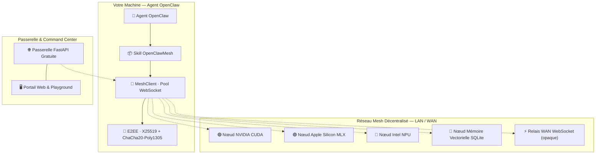

<div align="center">


# ⚡ OpenClawMesh

### Protocole P2P Décentralisé pour Agents IA · Inférence Multi-Matériels Universelle · 100% Gratuit & Souverain

[🇬🇧 Read in English](README.md) · [📐 Architecture](ARCHITECTURE.md) · [📜 Protocole](references/PROTOCOL_SPEC.md) · [🌐 Portail Passerelle](http://localhost:8000)

---

[](LICENSE.fr)
[](https://www.python.org/)
[](LICENSE.fr)
[](#-compatibilité-jarvismesh)
[](#-tests)
[](#-accélération-matérielle-universelle)

</div>

---

**OpenClawMesh** est un protocole pair-à-pair souverain et un Skill modulaire pour les agents IA **OpenClaw**. La connectivité LAN est le cas par défaut ; les fonctions WAN (DHT, relais et STUN) sont optionnelles et activables en un clic.

Les agents se découvrent sur le réseau local et Internet, délèguent du calcul, exploitent les GPU/NPU locaux, routent des charges utiles chiffrées de bout en bout et partagent une mémoire vectorielle persistante — **100% Gratuit et Open-Source, sans dépendre d'aucun prestataire cloud centralisé**.

---

## ✨ Fonctionnalités

<table>
<tr>
<td width="50%">

**🌐 Découverte Universelle & Routage WAN**
- LAN sans configuration via **mDNS Zeroconf** (double type de service : JarvisMesh & OpenClawMesh)
- WAN mondial via **DHT Kademlia 160-bit** (UDP réel, *k*=20, α=3, amorçage de seeds publics mondiaux & auto-refresh)
- **Mappage de Port Automatique UPnP** (SSDP M-SEARCH + SOAP IGD) & traversée NAT **STUN RFC 5389** avec fallback HTTPS
- **Routage de Relais WAN Transparent** avec bascule automatique côté client

**⚡ Moteur d'Inférence Universel**
- 🟢 **NVIDIA** — CUDA / TensorRT / PyTorch
- 🔴 **AMD** — ROCm / DirectML / HIP
- 🔵 **Intel Core Ultra** — NPU / OpenVINO / AVX-512
- 🟣 **Apple Silicon M1–M4** — Metal GPU via MLX-LM
- ⚪ **Fallback CPU** — Ollama / llama.cpp / vLLM

**🎯 Quantisation VRAM Automatique**
- Sélectionne le format optimal (4-bit, 8-bit, FP16) selon la VRAM disponible

</td>
<td width="50%">

**🔐 Sécurité Zéro-Confiance**
- **ChaCha20-Poly1305 AEAD** + **X25519 ECDH** — E2EE (les relais ne voient que le chiffré)
- Identités **Ed25519** + liste blanche `TrustStore`
- Anti-rejeu : fenêtre d'horodatage + cache de nonces borné

**🔀 Pipeline Distribué**
- Fragmentation de grands modèles LLM / MoE sur plusieurs nœuds
- **Streaming** natif (générateur async, token par token)

**👁️ IA Multi-Modale**
- Vision VLM (Qwen2-VL, Pixtral), STT (Whisper), TTS

**🌐 Passerelle d'Accès Libre & Command Center**
- Génération instantanée de clés d'API gratuites (sans carte, sans compte, 100% Free)
- Bascule Nœud WAN 100% Confiance en 1 clic (TLS + PSK)
- Console & Playground interactif de compétences en direct (LLM, RAG, Echo)

</td>
</tr>
</table>

---

## 🏛️ Architecture



---

## 🚀 Démarrage Rapide

### 1. Installation

```bash
# Installation minimale
pip install openclaw-mesh

# Avec support matériel & cryptographie complète
pip install "openclaw-mesh[all]"
```

### 2. Démarrage de la Passerelle & du Portail Web

```bash
# Lancer la passerelle sur le port 8000
uvicorn openclaw_mesh.gateway.server:app --host 127.0.0.1 --port 8000
```
Ouvrez **`http://localhost:8000`** dans votre navigateur pour accéder au Portail Web interactif et au Command Center.

### 3. Générer une Clé Gratuite & Exécuter une Compétence

```bash
# Génération d'une clé API gratuite et instantanée
curl -X POST http://localhost:8000/api/v1/checkout/free-key \
  -H "Content-Type: application/json" \
  -d '{"email":"communaute@openclaw.mesh"}'

# Exécuter une compétence d'inférence
export OPENCLAW_API_KEY="sk_claw_..."
curl -X POST http://localhost:8000/api/v1/execute \
  -H "X-API-Key: $OPENCLAW_API_KEY" \
  -H "Content-Type: application/json" \
  -d '{"skill":"llm","payload":{"prompt":"Bonjour IA décentralisée !"}}'
```

---

## 🧪 Tests

```bash
# Lancer la suite de tests complète
pytest tests/ -v

# Avec couverture de code
pytest tests/ -v --cov=openclaw_mesh

# Module spécifique
pytest tests/test_gateway.py -v
```

> **53 tests passants** — couvrant le réseau P2P, le DHT Kademlia, l'anti-rejeu E2EE, l'authentification d'identité, le relais WAN, la quantisation VRAM, les moteurs multi-modaux et la passerelle d'accès libre.

---

## 🔁 Compatibilité JarvisMesh

OpenClawMesh est **wire-compatible avec JarvisMesh 1.0** :
- Même format JSON (`type`, `skill`, `payload`, `request_id`, `origin`, `ts`, `sig`)
- Même base de signature HMAC-SHA256 (JSON trié canonique)
- Double enregistrement mDNS (`_jarvismesh._tcp.local.` + `_openclawmesh._tcp.local.`)

Les nœuds JarvisMesh peuvent appeler des nœuds OpenClawMesh et vice versa sans modification.

---

## ⚙️ Configuration

Tous les paramètres sont pilotés par des variables d'environnement (préfixe `OPENCLAW_`) :

```bash
OPENCLAW_NODE_NAME=mon-noeud-prod     # Nom du nœud (mDNS)
OPENCLAW_DEFAULT_PORT=8770           # Port WebSocket
OPENCLAW_PSK=votre_psk_secret        # Clé pré-partagée HMAC
OPENCLAW_E2EE_ENABLED=true           # Chiffrement de bout en bout
OPENCLAW_DHT_ENABLED=true            # Découverte WAN DHT Kademlia
OPENCLAW_LOG_LEVEL=INFO              # DEBUG / INFO / WARNING
GATEWAY_ADMIN_TOKEN=votre_admin_token # Passerelle : token admin API
GATEWAY_DB_PATH=/data/keys.db        # Passerelle : chemin SQLite
```

Référence complète : [`config.py`](openclaw_mesh/config.py) · [`ARCHITECTURE.md`](ARCHITECTURE.md)

---

## 📁 Structure du Projet

```
OpenClawMesh/
├── openclaw_mesh/
│   ├── node.py            # Serveur WebSocket (dispatch skills, authentification)
│   ├── client.py          # Client WebSocket (pool de connexions, multiplexage, repli relais)
│   ├── protocol.py        # Format wire JSON (TaskRequest/Chunk/Response)
│   ├── bridge.py          # SkillRegistry (support sync/async/générateur)
│   ├── crypto.py          # NodeIdentity Ed25519 & TrustStore
│   ├── crypto_e2ee.py     # Sessions E2EE X25519 + ChaCha20-Poly1305
│   ├── discovery.py       # Découverte LAN mDNS/Zeroconf
│   ├── config.py          # Pydantic Settings (singleton piloté par env)
│   ├── cli.py             # CLI argparse (11 commandes)
│   ├── engines/
│   │   ├── hardware.py        # Détection matériel universelle
│   │   ├── inference.py       # Moteur MLX / CUDA / OpenVINO / CPU
│   │   ├── model_manager.py   # Quantisation VRAM auto & sélection modèle
│   │   ├── distributed_moe.py # Pipeline MoE distribué entre nœuds
│   │   └── multimodal.py      # Vision / STT / TTS
│   ├── network/
│   │   ├── dht.py             # DHT Kademlia 160-bit (transport UDP, seeds & auto-refresh)
│   │   ├── relay.py           # Relais WAN WebSocket (routage opaque)
│   │   └── nat_traversal.py   # STUN RFC 5389 & mappage de port auto UPnP
│   └── gateway/
│       ├── server.py          # Passerelle FastAPI (clés gratuites, exécution, contrôle WAN)
│       ├── db.py              # KeyDatabase SQLite (clés, quotas, logs d'audit)
│       └── portal.py          # Interface web (générateur libre, console WAN, playground)
├── tests/                 # 53 tests unitaires & d'intégration
├── ARCHITECTURE.md        # Documentation technique complète niveau ingénieur senior
├── SKILL.md               # Descripteur de Skill OpenClaw
├── LICENSE                # Licence MIT (100% Free & Open Source)
├── LICENSE.fr             # Licence MIT en français
└── pyproject.toml
```

---

## 📄 Licence

OpenClawMesh est distribué sous **[Licence MIT](LICENSE.fr)** — 100% Gratuit et Open Source.

---

<div align="center">

**OpenClawMesh © 2026 — IA Décentralisée · Calcul Souverain · 100% Gratuit**

*Construit avec ⚡ pour les agents IA qui n'ont pas besoin de demander la permission*

</div>
