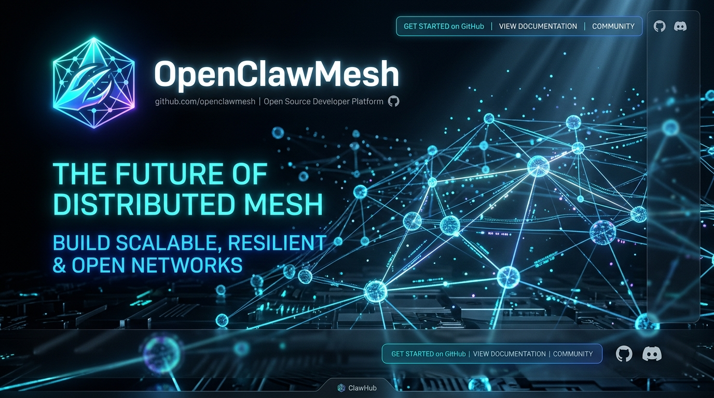
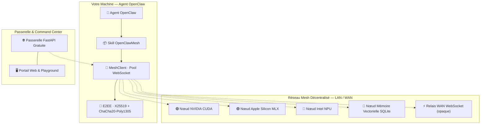

<div align="center">



<br/>


# ⚡ OpenClawMesh

### Protocole P2P d'Agents IA · Inférence Universelle Multi-Matériels · 100% Gratuit & Souverain

[🇬🇧 Read in English](README.md) · [📜 Livre Blanc (Whitepaper)](WHITEPAPER.md) · [📘 Manuel d'Utilisation (Notice)](docs/MANUAL.md) · [📐 Architecture](ARCHITECTURE.md) · [🌐 Portail Gateway](http://localhost:8000)

---

[](LICENSE.fr)
[](https://www.python.org/)
[](LICENSE.fr)
[](#-compatibilit%C3%A9-avec-jarvismesh)
[](file:///Users/selim/Desktop/OpenClawMesh/tests)
[](WHITEPAPER.md)

[](#-acc%C3%A9l%C3%A9ration-mat%C3%A9rielle-universelle)

</div>

---

**OpenClawMesh** est un protocole pair-à-pair souverain et un Skill modulaire pour les agents IA **OpenClaw**. La connectivité locale (LAN) est le mode d'exécution sécurisé par défaut ; les extensions WAN (DHT, relais, GossipSub et traversée STUN) sont strictement optionnelles et soumises au consentement explicite de l'utilisateur.

Les agents se découvrent sur le réseau local, délèguent du calcul, exploitent les GPU/NPU locaux, routent des charges utiles chiffrées de bout en bout, diffusent en streaming ultra-rapide UDP sub-10ms et partagent une mémoire vectorielle — **100% Libre, Open-Source et Souverain**.

> [!IMPORTANT]
> **Sécurité, Données & Consentement Opérateur :**
> - **LAN-First par défaut** : Aucune communication WAN (Internet, STUN, DHT, UPnP) n'est engagée sans demande explicite de l'opérateur.
> - **Contrôle des flux** : La délégation de calculs, prompts, fichiers, audio/images ou résultats d'outils vers un pair distant requiert l'autorisation de l'utilisateur.
> - **Exposition WAN Sécurisée** : Tout accès externe requiert obligatoirement le chiffrement TLS et une clé PSK ou TrustStore Ed25519.

---

## ✨ Fonctionnalités

<table>
<tr>
<td width="50%">

**🌐 Découverte Locale & Routage P2P**
- Découverte LAN sans configuration via **mDNS Zeroconf** (JarvisMesh & OpenClawMesh)
- Routage WAN via **DHT Kademlia 160-bit** avec **Content Routing & Provider Records**
- Traversée NAT **STUN RFC 5389** & **Relais E2EE** (strictement opt-in)
- Mappage de port optionnel **UPnP IGD** sur demande explicite

**⚡ Transport Ultra-Basse Latence (QUIC / WebRTC UDP)**
- Tunnels UDP directs pour streaming token-par-token sub-10ms
- Cadrage protocolaire binaire léger (`OCQ1`)
- Multiplexage asynchrone et handshakes 0-RTT/1-RTT
- Traversée NAT par punch hole sans ouverture de port manuel

**📡 Overlay Pub/Sub GossipSub v1.1**
- Diffusion thématique décentralisée tolérante aux pannes
- Maintien du maillage (`GRAFT` / `PRUNE` avec backoff exponentiel)
- Eager push combiné au potin paresseux (`IHAVE` / `IWANT`)
- Cache glissant de déduplication (`mcache`) et scoring anti-spam

</td>
<td width="50%">

**⚡ Moteur d'Inférence Universel Multi-Matériels**
- 🟢 **NVIDIA** — CUDA / TensorRT / PyTorch
- 🔴 **AMD** — ROCm / DirectML / HIP
- 🔵 **Intel Core Ultra** — NPU / OpenVINO / AVX-512
- 🟣 **Apple Silicon M1–M4** — Metal GPU via MLX-LM
- ⚪ **Fallback CPU** — Ollama / llama.cpp / vLLM

**🔐 Sécurité Zéro-Confiance & Anti-Rejeu**
- **ChaCha20-Poly1305 AEAD** + **X25519 ECDH** — E2EE (les relais ne voient que le chiffré)
- Identités **Ed25519** + contrôle d'accès `TrustStore`
- Anti-rejeu complet : fenêtre d'horodatage + cache de requêtes et nonces borné

**🔀 Pipeline Distribué & MoE**
- Fragmentation MoE avec transmission de tenseurs quantifiés réels
- **Streaming** natif (SSE, token par token)

**🎯 Quantisation VRAM & Cache Sémantique**
- Sélection dynamique du format optimal (4-bit, 8-bit, FP16)
- **KV-Cache Sémantique** avec éviction mémoire LRU
</td>
</tr>
</table>

---

## 🏛️ Architecture



---

## 🚀 Démarrage Rapide

### 1. Installation

```bash
# Installation minimale
pip install openclaw-mesh

# Avec support matériel & cryptographie complète
pip install "openclaw-mesh[all]"
```

### 2. Démarrage de la Passerelle & du Portail Web

```bash
# Lancer la passerelle sur le port 8000
uvicorn openclaw_mesh.gateway.server:app --host 127.0.0.1 --port 8000
```
Ouvrez **`http://localhost:8000`** dans votre navigateur pour accéder au Portail Web interactif et au Command Center.

### 3. Générer une Clé Gratuite & Exécuter une Compétence

```bash
# Génération d'une clé API gratuite et instantanée
curl -X POST http://localhost:8000/api/v1/checkout/free-key \
  -H "Content-Type: application/json" \
  -d '{"email":"communaute@openclaw.mesh"}'

# Exécuter une compétence d'inférence
export OPENCLAW_API_KEY="sk_claw_..."
curl -X POST http://localhost:8000/api/v1/execute \
  -H "X-API-Key: $OPENCLAW_API_KEY" \
  -H "Content-Type: application/json" \
  -d '{"skill":"llm","payload":{"prompt":"Bonjour IA décentralisée !"}}'
```

---

## 🧪 Tests

```bash
# Lancer la suite de tests complète
pytest tests/ -v

# Avec couverture de code
pytest tests/ -v --cov=openclaw_mesh

# Module spécifique
pytest tests/test_gateway.py -v
```

> **70 tests passants** — couvrant le réseau P2P, le transport ultra-rapide QUIC/WebRTC UDP, l'overlay pub/sub GossipSub v1.1, le DHT Kademlia (bootstrap, auto-refresh & provider records), l'anti-rejeu E2EE, l'authentification d'identité, le relais WAN, la quantisation VRAM, les moteurs multi-modaux et la passerelle d'accès libre.

---

## 🔁 Compatibilité JarvisMesh

OpenClawMesh est **wire-compatible avec JarvisMesh 1.0** :
- Même format JSON (`type`, `skill`, `payload`, `request_id`, `origin`, `ts`, `sig`)
- Même base de signature HMAC-SHA256 (JSON trié canonique)
- Double enregistrement mDNS (`_jarvismesh._tcp.local.` + `_openclawmesh._tcp.local.`)

Les nœuds JarvisMesh peuvent appeler des nœuds OpenClawMesh et vice versa sans modification.

---

## ⚙️ Configuration

Tous les paramètres sont pilotés par des variables d'environnement (préfixe `OPENCLAW_`) :

```bash
OPENCLAW_NODE_NAME=mon-noeud-prod     # Nom du nœud (mDNS)
OPENCLAW_DEFAULT_PORT=8770           # Port WebSocket
OPENCLAW_QUIC_ENABLED=true           # Transport direct UDP QUIC ultra-basse latence
OPENCLAW_QUIC_PORT=8775              # Port UDP QUIC
OPENCLAW_GOSSIPSUB_ENABLED=true      # Overlay Pub/Sub GossipSub v1.1
OPENCLAW_PSK=votre_psk_secret        # Clé pré-partagée HMAC
OPENCLAW_E2EE_ENABLED=true           # Chiffrement de bout en bout
OPENCLAW_DHT_ENABLED=true            # Découverte WAN DHT Kademlia
OPENCLAW_LOG_LEVEL=INFO              # DEBUG / INFO / WARNING
GATEWAY_ADMIN_TOKEN=votre_admin_token # Passerelle : token admin API
GATEWAY_DB_PATH=/data/keys.db        # Passerelle : chemin SQLite
```

Référence complète : [`config.py`](openclaw_mesh/config.py) · [`ARCHITECTURE.md`](ARCHITECTURE.md)

---

## 📁 Structure du Projet

```
OpenClawMesh/
├── openclaw_mesh/
│   ├── node.py            # Serveur de nœud (WebSocket + QUIC UDP + dispatch GossipSub)
│   ├── client.py          # Client MeshClient (pool WebSocket, multiplexage QUIC, repli DHT)
│   ├── protocol.py        # Format wire JSON (TaskRequest/Chunk/Response)
│   ├── bridge.py          # SkillRegistry (support sync/async/générateur)
│   ├── crypto.py          # NodeIdentity Ed25519 & TrustStore
│   ├── crypto_e2ee.py     # Sessions E2EE X25519 + ChaCha20-Poly1305
│   ├── discovery.py       # Découverte LAN mDNS/Zeroconf
│   ├── config.py          # Pydantic Settings (singleton piloté par env)
│   ├── cli.py             # CLI argparse (12 commandes : discover, call, stream, ping, serve, dht, gossipsub...)
│   ├── engines/
│   │   ├── hardware.py        # Détection matériel universelle
│   │   ├── inference.py       # Moteur MLX / CUDA / OpenVINO / CPU
│   │   ├── model_manager.py   # Quantisation VRAM auto & sélection modèle
│   │   ├── distributed_moe.py # Pipeline MoE distribué entre nœuds
│   │   └── multimodal.py      # Vision / STT / TTS
│   ├── network/
│   │   ├── quic_webrtc.py     # Transport direct UDP QUIC ultra-basse latence & streaming
│   │   ├── gossipsub.py       # Overlay Pub/Sub décentralisé v1.1 (GRAFT/PRUNE, IHAVE/IWANT)
│   │   ├── dht.py             # DHT Kademlia 160-bit & Content Routing / Provider Records
│   │   ├── relay.py           # Relais WAN WebSocket (routage opaque)
│   │   └── nat_traversal.py   # STUN RFC 5389 & mappage de port auto UPnP
│   └── gateway/
│       ├── server.py          # Passerelle FastAPI (clés gratuites, exécution, contrôle WAN)
│       ├── db.py              # KeyDatabase SQLite (clés, quotas, logs d'audit)
│       └── portal.py          # Interface web (générateur libre, console WAN, playground)
├── tests/                 # 70 tests unitaires & d'intégration
├── ARCHITECTURE.md        # Documentation technique complète niveau ingénieur senior
├── SKILL.md               # Descripteur de Skill OpenClaw
├── LICENSE                # Licence MIT (100% Free & Open Source)
├── LICENSE.fr             # Licence MIT en français
└── pyproject.toml
```

---

## 📄 Licence

OpenClawMesh est distribué sous **[Licence MIT](LICENSE.fr)** — 100% Gratuit et Open Source.

---

<div align="center">

**OpenClawMesh © 2026 — IA Décentralisée · Calcul Souverain · 100% Gratuit**

*Construit avec ⚡ pour les agents IA qui n'ont pas besoin de demander la permission*

</div>
