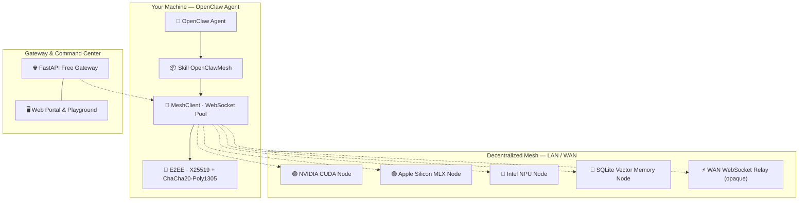

<div align="center">


<br/>


# ⚡ OpenClawMesh

### Decentralized AI Agent Protocol · Universal Multi-Hardware Inference · 100% Free & Sovereign

[🇫🇷 Lire en Français](README.fr.md) · [📐 Architecture](ARCHITECTURE.md) · [📜 Protocol Spec](references/PROTOCOL_SPEC.md) · [🌐 Gateway Portal](http://localhost:8000)

---

[](LICENSE)
[](https://www.python.org/)
[](LICENSE)
[](#-jarvismesh-compatibility)
[](#-tests)
[](#-universal-hardware-acceleration)

</div>

---

**OpenClawMesh** is a sovereign peer-to-peer framework and modular Skill for **OpenClaw** AI agents. LAN connectivity is the default, secure execution mode; WAN features (DHT, relay, and STUN traversal) are strictly optional and subject to explicit user consent.

Agents discover each other on the local network, delegate compute, leverage local GPU/NPU hardware, route end-to-end encrypted payloads, and share episodic memory — **100% Free, Open-Source & Sovereign**.

> [!IMPORTANT]
> **Security, Data Privacy & Operator Consent:**
> - **LAN-First by default**: No WAN communication (Internet, STUN, DHT, UPnP) is initiated without explicit operator request.
> - **Flow Control**: Delegating compute, prompts, files, audio/images, or tool outputs to a remote peer requires operator approval.
> - **Secured WAN Exposure**: Any external access strictly requires TLS encryption and a shared PSK or Ed25519 TrustStore.

---

## ✨ Features

<table>
<tr>
<td width="50%">

**🌐 Local Discovery & P2P Routing**
- Zero-config LAN discovery via **mDNS Zeroconf** (JarvisMesh & OpenClawMesh)
- Optional WAN routing via **Kademlia DHT 160-bit** (real UDP, *k*=20, α=3 with configured seeds)
- **STUN RFC 5389** NAT traversal & **E2EE Relay** (strictly opt-in)
- Optional **UPnP IGD** port mapping upon explicit operator activation

**⚡ Multi-Hardware Universal Inference Engine**
- 🟢 **NVIDIA** — CUDA / TensorRT / PyTorch
- 🔴 **AMD** — ROCm / DirectML / HIP
- 🔵 **Intel Core Ultra** — NPU / OpenVINO / AVX-512
- 🟣 **Apple Silicon M1–M4** — Metal GPU via MLX-LM
- ⚪ **CPU Fallback** — Ollama / llama.cpp / vLLM

**🎯 VRAM Quantization & Semantic Cache**
- Dynamic quantization format selection (4-bit, 8-bit, FP16)
- **Semantic KV-Cache** with LRU memory eviction

</td>
<td width="50%">

**🔐 Zero-Trust Security & Anti-Replay**
- **ChaCha20-Poly1305 AEAD** + **X25519 ECDH** — E2EE (relays see only ciphertext)
- **Ed25519** node identities + `TrustStore` access control
- Comprehensive anti-replay: timestamp freshness window + bounded request/nonce cache

**🔀 Distributed Pipeline & MoE**
- Distributed MoE with real quantized tensor buffers
- Native **streaming** (SSE, token-by-token)

**👁️ Multi-Modal AI & Tools**
- Vision VLM, STT (Whisper), TTS connectors
- Standard **OpenAI Tools / Function Calling** compatibility

**🖥️ Web Portal & Local Command Center**
- Interactive Mesh Visualizer (2D/3D Canvas)
- Live Chat Playground (LLM, RAG, Echo)
- Local FastAPI Gateway with authentication
</td>
</tr>
</table>

---

## 🏛️ Architecture



---

## 🚀 Quick Start

### 1. Installation

```bash
# Minimal install
pip install openclaw-mesh

# With full cryptography & hardware acceleration
pip install "openclaw-mesh[all]"
```

### 2. Launch the Free Gateway & Web Portal

```bash
# Start gateway on port 8000
uvicorn openclaw_mesh.gateway.server:app --host 127.0.0.1 --port 8000
```
Open **`http://localhost:8000`** in your browser to access the Web Portal & Command Center.

### 3. Generate a Free API Key & Execute Skills

```bash
# Instant free API key generation
curl -X POST http://localhost:8000/api/v1/checkout/free-key \
  -H "Content-Type: application/json" \
  -d '{"email":"community@openclaw.mesh"}'

# Execute inference with your key
export OPENCLAW_API_KEY="sk_claw_..."
curl -X POST http://localhost:8000/api/v1/execute \
  -H "X-API-Key: $OPENCLAW_API_KEY" \
  -H "Content-Type: application/json" \
  -d '{"skill":"llm","payload":{"prompt":"Hello decentralized AI!"}}'
```

---

## 🧪 Tests

```bash
# Run full test suite
pytest tests/ -v

# With coverage
pytest tests/ -v --cov=openclaw_mesh

# Specific module
pytest tests/test_gateway.py -v
```

> **53 tests passing** — covering P2P networking, Kademlia DHT bootstrap & auto-refresh, UPnP port mapping & STUN traversal, E2EE anti-replay and identity authentication, WAN relay routing, VRAM quantization, multi-modal engines, and the Free Gateway.

---

## 🔁 JarvisMesh Compatibility

OpenClawMesh is **wire-compatible with JarvisMesh 1.0**:
- Same JSON message format (`type`, `skill`, `payload`, `request_id`, `origin`, `ts`, `sig`)
- Same HMAC-SHA256 signing base (canonical sorted JSON)
- Dual mDNS service registration (`_jarvismesh._tcp.local.` + `_openclawmesh._tcp.local.`)

JarvisMesh nodes can call OpenClawMesh nodes and vice versa without any modification.

---

## ⚙️ Configuration

All settings are driven by environment variables (prefix `OPENCLAW_`):

```bash
OPENCLAW_NODE_NAME=my-prod-node      # Node name (mDNS)
OPENCLAW_DEFAULT_PORT=8770           # WebSocket port
OPENCLAW_PSK=your_psk_secret         # HMAC pre-shared key
OPENCLAW_E2EE_ENABLED=true           # End-to-end encryption
OPENCLAW_DHT_ENABLED=true            # Kademlia DHT WAN discovery
OPENCLAW_LOG_LEVEL=INFO              # DEBUG / INFO / WARNING
GATEWAY_ADMIN_TOKEN=your_admin_token # Gateway: admin API token
GATEWAY_DB_PATH=/data/keys.db        # Gateway: SQLite path
```

Full reference: [`config.py`](openclaw_mesh/config.py) · [`ARCHITECTURE.md`](ARCHITECTURE.md)

---

## 📁 Project Structure

```
OpenClawMesh/
├── openclaw_mesh/
│   ├── node.py            # WebSocket server (skill dispatch, auth)
│   ├── client.py          # WebSocket client (connection pool, multiplexing, relay fallback)
│   ├── protocol.py        # Wire format JSON (TaskRequest/Chunk/Response)
│   ├── bridge.py          # SkillRegistry (sync/async/generator support)
│   ├── crypto.py          # Ed25519 NodeIdentity & TrustStore
│   ├── crypto_e2ee.py     # X25519 + ChaCha20-Poly1305 E2EE sessions
│   ├── discovery.py       # mDNS/Zeroconf LAN discovery
│   ├── config.py          # Pydantic Settings (env-driven singleton)
│   ├── cli.py             # argparse CLI (11 commands)
│   ├── engines/
│   │   ├── hardware.py    # Universal hardware detection
│   │   ├── inference.py   # MLX / CUDA / OpenVINO / CPU inference engine
│   │   ├── model_manager.py   # Auto VRAM quantization & model selection
│   │   ├── distributed_moe.py # Pipeline parallelism across nodes
│   │   └── multimodal.py  # Vision / STT / TTS
│   ├── network/
│   │   ├── dht.py         # Kademlia 160-bit DHT (UDP transport, global seeds & auto-refresh)
│   │   ├── relay.py       # WAN WebSocket relay (opaque routing)
│   │   └── nat_traversal.py   # STUN RFC 5389 & UPnP auto port mapping NAT discovery
│   └── gateway/
│       ├── server.py      # FastAPI gateway (Free keys, execution, WAN control)
│       ├── db.py          # SQLite KeyDatabase (keys, quotas, audit logs)
│       └── portal.py      # Web UI (Free key generator, command center, playground)
├── tests/                 # 53 unit & integration tests
├── ARCHITECTURE.md        # Full technical documentation (senior engineer level)
├── SKILL.md               # OpenClaw skill descriptor
├── LICENSE                # MIT License (100% Free & Open Source)
└── pyproject.toml
```

---

## 📄 License

OpenClawMesh is distributed under the **[MIT License](LICENSE)** — 100% Free and Open Source.

---

<div align="center">

**OpenClawMesh © 2026 — Decentralized AI · Sovereign Compute · 100% Free**

*Built with ⚡ for AI agents that don't ask permission*

</div>
