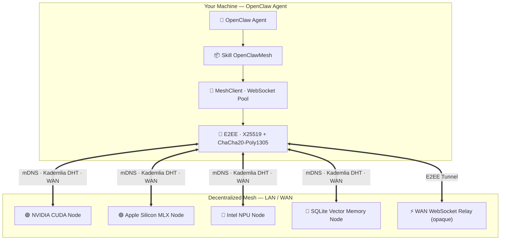

<div align="center">


# ⚡ OpenClawMesh

### Decentralized AI Agent Protocol · Universal Multi-Hardware Inference · Bitcoin-Native

[🇫🇷 Lire en Français](README.fr.md) · [📐 Architecture](ARCHITECTURE.md) · [📜 Protocol Spec](references/PROTOCOL_SPEC.md) · [🌐 Gateway Portal](http://localhost:8000)

---

[](LICENSE)
[](https://www.python.org/)
[](LICENSE)
[](#-jarvismesh-compatibility)
[](#-tests)
[](#-universal-hardware-acceleration)

</div>

---

**OpenClawMesh** is a sovereign peer-to-peer framework and modular Skill for **OpenClaw** AI agents. LAN connectivity is the default use case; WAN features (DHT, relay, and STUN) are optional and must be enabled separately.

Agents discover each other over LAN and the Internet, delegate compute, leverage local GPU/NPU hardware, route end-to-end encrypted payloads, and share persistent vector memory — **with zero dependency on any centralized cloud provider**.
Payments for the managed gateway are **Bitcoin-only** — no account, no KYC, no banks.

> **Security notice:** the gateway is an optional monetization component, not required for mesh connectivity. It handles payment metadata and API credentials. The external BTC price oracle is disabled by default; enabling it sends requests to the configured provider. Review and isolate this component before exposing it.

---

## ✨ Features

<table>
<tr>
<td width="50%">

**🌐 Dual-Layer Discovery**
- Zero-config LAN via **mDNS Zeroconf** (dual service type: JarvisMesh & OpenClawMesh)
- Global WAN via **Kademlia DHT 160-bit** (real UDP, *k*=20, α=3, iterative lookups), only after explicit opt-in

**⚡ Universal Inference Engine**
- 🟢 **NVIDIA** — CUDA / TensorRT / PyTorch
- 🔴 **AMD** — ROCm / DirectML / HIP
- 🔵 **Intel Core Ultra** — NPU / OpenVINO / AVX-512
- 🟣 **Apple Silicon M1–M4** — Metal GPU via MLX-LM
- ⚪ **CPU Fallback** — Ollama / llama.cpp / vLLM

**🎯 Auto VRAM Quantization**
- Selects optimal model size & format (4-bit, 8-bit, FP16) from detected VRAM

</td>
<td width="50%">

**🔐 Zero-Trust Security**
- **ChaCha20-Poly1305 AEAD** + **X25519 ECDH** — E2EE (relays see only ciphertext)
- **Ed25519** node identities + `TrustStore` allowlist
- Anti-replay: timestamp freshness window + bounded nonce cache

**🔀 Distributed Pipeline**
- Split LLM / MoE models across mesh nodes (pipeline parallelism)
- Native **streaming** (async generator, token-by-token)

**👁️ Multi-Modal AI**
- Vision VLM (Qwen2-VL, Pixtral), STT (Whisper), TTS

**₿ Bitcoin Payment Gateway**
- No Stripe, no PayPal — pure **BTC on-chain**
- On-chain verification is disabled by default; enable it explicitly after reviewing the operational risks
- BTC/EUR oracle with cached multi-source median and fixed quote per payment

</td>
</tr>
</table>

---

## 🏛️ Architecture



### Module Map

| Layer | Module | Responsibility |
|---|---|---|
| Transport | `node.py` · `client.py` | WebSocket server + multiplexed connection pool |
| Protocol | `protocol.py` · `bridge.py` | Wire format JSON · SkillRegistry |
| Discovery | `discovery.py` · `network/dht.py` | mDNS + Kademlia 160-bit UDP |
| Security | `crypto.py` · `crypto_e2ee.py` | Ed25519 identity · X25519+ChaCha20 E2EE |
| Inference | `engines/` | Hardware detection · MLX/CUDA/OpenVINO · MoE · Multimodal |
| Gateway | `gateway/` | FastAPI · SQLite · Bitcoin payment flow · Web portal |
| Config | `config.py` | Pydantic Settings · singleton · env-driven |

---

## 🚀 Quick Start

```bash
# Clone & install
git clone https://github.com/samajesteduroyaume/OpenClawMesh.git
cd OpenClawMesh
pip install -e ".[all]"

# Link as OpenClaw skill
mkdir -p ~/.openclaw/skills
ln -s "$(pwd)" ~/.openclaw/skills/openclaw-mesh
```

**Minimal extras:**
```bash
pip install -e "."          # WebSocket + mDNS only
pip install -e ".[crypto]"  # + Ed25519 support
pip install -e ".[rich]"    # + Rich CLI output
pip install -e ".[all]"     # Everything
```

---

## 💻 CLI Reference

```bash
# Diagnose hardware & VRAM
openclaw-mesh hardware

# Discover LAN peers
# WARNING: scans the LAN and introspects peer capabilities; review the results before sending data.
openclaw-mesh discover --enable-discovery --timeout 5 --inspect

# Call a skill on a peer
openclaw-mesh call my-node llm --payload '{"prompt": "Hello"}'

# Stream tokens in real-time
openclaw-mesh stream my-node llm --payload '{"prompt": "Write a haiku"}'

# Ping latency
openclaw-mesh ping my-node

# Serve this machine as a mesh node
# WARNING: accepts remote task traffic; use only with trusted peers and a randomly generated secret.
openclaw-mesh serve --name my-agent --port 8770 --psk "$(openssl rand -hex 32)"

# Generate Ed25519 identity
# WARNING: creates a private key; protect this file and never commit it.
openclaw-mesh keygen --output ~/.openclaw/identity.key

# Kademlia DHT — publish & lookup
# WARNING: publishes node/capability metadata over UDP to the configured bootstrap peer.
openclaw-mesh dht --advertise llm --bootstrap 192.0.2.5:8780
openclaw-mesh dht --lookup llm   --bootstrap 192.0.2.5:8780

# Start WAN WebSocket relay
# WARNING: exposes an inbound relay service; configure TLS/authentication and a firewall first.
openclaw-mesh relay --port 8790

# Multi-modal inference
openclaw-mesh multimodal --task vision --prompt "Describe this image."
openclaw-mesh multimodal --task tts    --prompt "Welcome to OpenClawMesh."

# E2EE key management
openclaw-mesh e2ee --action generate
openclaw-mesh e2ee --action test
```

---

## 🐍 Python SDK

```python
import asyncio
import os
from openclaw_mesh import OpenClawMeshNode, MeshClient, SkillRegistry

# ── Start a node ──────────────────────────────────────────────────────
registry = SkillRegistry(name="my-node")


async def llm(payload: dict) -> dict:
    return {"text": f"Answer: {payload.get('prompt')}", "model": "local"}


registry.register(llm, expose_remote=True)


async def serve():
    node = OpenClawMeshNode(
        name="my-node", port=8770, psk=os.environ["OPENCLAW_PSK"], registry=registry
    )
    await node.start(enable_zeroconf=False)  # Enable only after reviewing LAN exposure.
    await asyncio.Event().wait()


# ── Call from a client ────────────────────────────────────────────────
async def client_demo():
    client = MeshClient(name="orchestrator", psk=os.environ["OPENCLAW_PSK"], enable_discovery=False)
    await client.start()

    # Direct call
    resp = await client.call("my-node", "llm", {"prompt": "What is P2P?"})
    print(resp.result)

    # Auto-route to best peer
    resp = await client.delegate("llm", {"prompt": "Optimize this code"})
    print(resp.result)

    # Streaming
    await client.call_stream(
        "my-node",
        "llm",
        {"prompt": "Tell me a story"},
        on_chunk=lambda c: print(c, end="", flush=True),
    )
    await client.stop()
```

---

## 🔐 Security Model

```
┌─────────────────────────────────────────────────────────┐
│ Layer 3 — E2EE (optional, strongly recommended on WAN)  │
│  X25519 ECDH + HKDF-SHA256 + ChaCha20-Poly1305          │
│  Relays never decrypt content                            │
├─────────────────────────────────────────────────────────┤
│ Layer 2 — Ed25519 Auth (optional)                        │
│  Per-node identity · TrustStore allowlist · ±300s drift  │
├─────────────────────────────────────────────────────────┤
│ Layer 1 — HMAC-SHA256 (optional, JarvisMesh-compatible)  │
│  Pre-shared key · compare_digest (timing-safe)           │
├─────────────────────────────────────────────────────────┤
│ Layer 0 — TLS Transport (optional)                       │
│  Inject ssl.SSLContext into Node and Client              │
└─────────────────────────────────────────────────────────┘
```

```python
# Generate node identity
from openclaw_mesh import NodeIdentity, TrustStore

identity = NodeIdentity.generate()
identity.save("~/.openclaw/identity.key")
print(identity.public_key_hex)  # Share with peers

# E2EE session
from openclaw_mesh import E2EESession

session = E2EESession()
session.establish_with_peer(peer_pubkey_bytes)
packet = session.encrypt({"secret": "payload"})
data = session.decrypt(packet)
```

---

## ₿ Bitcoin Payment Gateway

> Self-host the gateway or use the managed service — payments are Bitcoin-only, no account required.

### Plans

| Plan | Price | Duration | Access |
|---|---|---|---|
| 🆓 **Free Demo** | Free | 7 days | 3 API calls |
| ⚡ **Pro Monthly** | ≈ €10/month in BTC | 30 days per payment; new key on renewal | No quota limit (subject to rate limits and capacity) |
| 👑 **Lifetime** | ≈ €200 one-time in BTC | Forever | All future updates · VIP support |

**Bitcoin wallet:** `bc1qwq8sll9vrl83lclyhha2gyncpd5275cdr2wul5`

The gateway calculates the satoshi amount using the BTC/EUR oracle at submission time. The rate and expected amount are then fixed for that payment. After `BTC_REQUIRED_CONFIRMATIONS` is reached, the API key is activated automatically. Use the private `status_token` returned by submission to query the payment status.

### Payment Flow

```bash
# 1. Get payment info & wallet address
curl http://localhost:8000/api/v1/payment/info

# 2. Send BTC → submit your txid
curl -X POST http://localhost:8000/api/v1/payment/submit \
  -H "Content-Type: application/json" \
  -d '{"email":"you@example.com","plan":"pro_monthly","txid":"your_txid_here"}'
# → {"ok":true, "payment_id":"abc123...", "status_token":"...", "status":"pending_verification"}

# 3. Check status with the private token returned at submission
curl -H "X-Payment-Token: $STATUS_TOKEN" \
    http://localhost:8000/api/v1/payment/status/abc123

# 4. Use your key
export OPENCLAW_API_KEY="sk_claw_..."
curl -X POST http://localhost:8000/api/v1/execute \
  -H "X-API-Key: $OPENCLAW_API_KEY" \
  -H "Content-Type: application/json" \
  -d '{"skill":"llm","payload":{"prompt":"Hello world"}}'
```

### Self-Host the Gateway

```bash
export GATEWAY_ADMIN_TOKEN="your_secret_admin_token"
export BTC_WALLET_ADDRESS="bc1qwq8sll9vrl83lclyhha2gyncpd5275cdr2wul5"
export GATEWAY_DB_PATH="/data/openclaw_keys.db"

uvicorn openclaw_mesh.gateway.server:app --host 127.0.0.1 --port 8000
```

---

## 🧪 Tests

```bash
# Run full test suite
pytest tests/ -v

# With coverage
pytest tests/ -v --cov=openclaw_mesh

# Specific module
pytest tests/test_e2ee.py -v
```

> **41 tests passing** — covering P2P networking, Kademlia DHT, E2EE anti-replay and identity authentication, WAN relay, VRAM quantization, multi-modal engines, and the Bitcoin payment flow.

### Secure deployment

Copy [.env.example](.env.example) to `.env` and replace every placeholder. In
production, set random `GATEWAY_ADMIN_TOKEN` and `OPENCLAW_PSK` values, restrict
`GATEWAY_CORS_ORIGINS` to your frontend, use HTTPS/WSS, and keep the SQLite
database in a protected directory. The BTC amount is calculated by the oracle at
submission time and fixed for that payment. The key is activated automatically
after `BTC_REQUIRED_CONFIRMATIONS` confirmations.

---

## 🔁 JarvisMesh Compatibility

OpenClawMesh is **wire-compatible with JarvisMesh 1.0**:
- Same JSON message format (`type`, `skill`, `payload`, `request_id`, `origin`, `ts`, `sig`)
- Same HMAC-SHA256 signing base (canonical sorted JSON)
- Dual mDNS service registration (`_jarvismesh._tcp.local.` + `_openclawmesh._tcp.local.`)

JarvisMesh nodes can call OpenClawMesh nodes and vice versa without any modification.

---

## ⚙️ Configuration

All settings are driven by environment variables (prefix `OPENCLAW_`):

```bash
OPENCLAW_NODE_NAME=my-prod-node      # Node name (mDNS)
OPENCLAW_DEFAULT_PORT=8770           # WebSocket port
OPENCLAW_PSK=your_psk_secret         # HMAC pre-shared key
OPENCLAW_E2EE_ENABLED=true           # End-to-end encryption
OPENCLAW_DHT_ENABLED=true            # Kademlia DHT WAN discovery
OPENCLAW_LOG_LEVEL=INFO              # DEBUG / INFO / WARNING
BTC_WALLET_ADDRESS=bc1q...           # Gateway: your Bitcoin address
GATEWAY_ADMIN_TOKEN=your_admin_token # Gateway: admin API token
GATEWAY_DB_PATH=/data/keys.db        # Gateway: SQLite path
```

Full reference: [`config.py`](openclaw_mesh/config.py) · [`ARCHITECTURE.md`](ARCHITECTURE.md)

---

## 📁 Project Structure

```
OpenClawMesh/
├── openclaw_mesh/
│   ├── node.py            # WebSocket server (skill dispatch, auth)
│   ├── client.py          # WebSocket client (connection pool, multiplexing)
│   ├── protocol.py        # Wire format JSON (TaskRequest/Chunk/Response)
│   ├── bridge.py          # SkillRegistry (sync/async/generator support)
│   ├── crypto.py          # Ed25519 NodeIdentity & TrustStore
│   ├── crypto_e2ee.py     # X25519 + ChaCha20-Poly1305 E2EE sessions
│   ├── discovery.py       # mDNS/Zeroconf LAN discovery
│   ├── config.py          # Pydantic Settings (env-driven singleton)
│   ├── cli.py             # argparse CLI (11 commands)
│   ├── engines/
│   │   ├── hardware.py    # Universal hardware detection
│   │   ├── inference.py   # MLX / CUDA / OpenVINO / CPU inference engine
│   │   ├── model_manager.py   # Auto VRAM quantization & model selection
│   │   ├── distributed_moe.py # Pipeline parallelism across nodes
│   │   └── multimodal.py  # Vision / STT / TTS
│   ├── network/
│   │   ├── dht.py         # Kademlia 160-bit DHT (real UDP transport)
│   │   ├── relay.py       # WAN WebSocket relay (opaque routing)
│   │   └── nat_traversal.py   # STUN RFC 5389 NAT discovery
│   └── gateway/
│       ├── server.py      # FastAPI gateway (Bitcoin payments, key management)
│       ├── db.py          # SQLite KeyDatabase (quotas, expiry, payment logs)
│       └── portal.py      # Web UI (Bitcoin QR, payment form, playground)
├── tests/                 # 40 unit & integration tests
├── ARCHITECTURE.md        # Full technical documentation (senior engineer level)
├── SKILL.md               # OpenClaw skill descriptor
├── LICENSE                # MIT + Commercial Services Addendum (EN)
├── LICENSE.fr             # MIT + Addendum Services Commerciaux (FR)
└── pyproject.toml
```

---

## 🤝 Contributing

```bash
git clone https://github.com/samajesteduroyaume/OpenClawMesh.git
cd OpenClawMesh
pip install -e ".[dev]"
pre-commit install

# Code quality (mandatory before PR)
ruff check openclaw_mesh/   # 0 errors tolerated
black openclaw_mesh/ tests/
mypy openclaw_mesh/
pytest tests/ -v
```

**Conventions:**
- Type hints on all public/protected signatures
- `raise X from e` in all except blocks
- `asyncio.create_task()` over `ensure_future()`
- `asyncio.get_running_loop()` over `get_event_loop()`
- `logging.getLogger("openclaw_mesh.<module>")` — never `print()`

---

## 📄 License

**OpenClawMesh core** (library, protocol, CLI) — [MIT License](LICENSE)

**Managed gateway & hosted relays** — Commercial service, Bitcoin-only:
- `bc1qwq8sll9vrl83lclyhha2gyncpd5275cdr2wul5`
- Full terms: [LICENSE](LICENSE) (English) · [LICENSE.fr](LICENSE.fr) (Français)

---

<div align="center">

**OpenClawMesh © 2026 — Decentralized AI · Sovereign Compute · Bitcoin-Native**

*Built with ⚡ for AI agents that don't ask permission*

</div>
