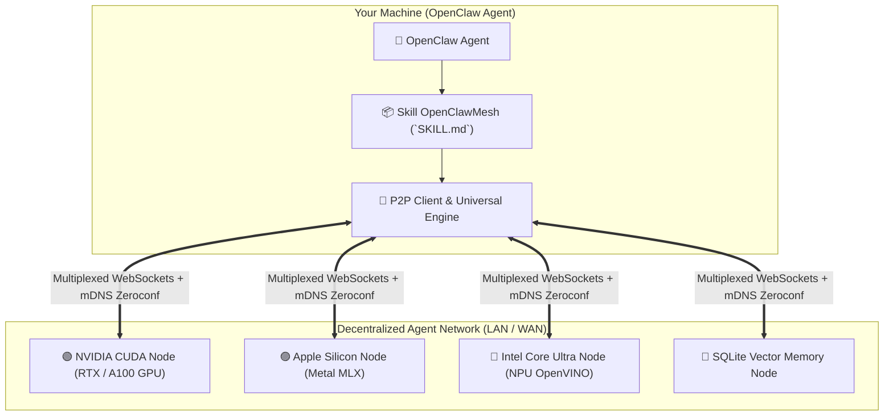

# 🌐 OpenClawMesh — Decentralized AI Agent Protocol & Universal Multi-Hardware Inference

[🇬🇧 Read in English](README.md) | [🇫🇷 Lire en Français](README.fr.md) | [📜 Protocol Specification](references/PROTOCOL_SPEC.md) | [📄 Commercial License](LICENSE)

[](LICENSE)
[](https://www.python.org/downloads/)
[](SKILL.md)
[](#-jarvismesh-interoperability)
[](#-universal-hardware-acceleration)

**OpenClawMesh** is a sovereign peer-to-peer (P2P) networking framework and modular Skill designed for **OpenClaw** artificial intelligence agents.

It enables OpenClaw agents to autonomously discover peer nodes on the local network (LAN) and remote clusters, delegate heavy computation, harness local GPU/NPU acceleration, and access shared persistent vector memory without relying on any centralized cloud provider.

---

## ✨ Key Features

1. 📡 **Zero-Configuration P2P Discovery (mDNS)**:
   - Instant discovery of active agent nodes across your local network (LAN) and WAN relays.
   - Dynamic introspection of remote agent capabilities via `_describe_skills`.

2. ⚡ **Universal Multi-Hardware AI Inference**:
   - 🟢 **NVIDIA GPUs**: Native CUDA / TensorRT / PyTorch acceleration.
   - 🔴 **AMD GPUs**: ROCm / DirectML / HIP GPU acceleration.
   - 🔵 **Intel Core Ultra & Arc**: Intel NPU, OpenVINO, oneAPI, and AVX-512 acceleration.
   - 🟣 **Apple Silicon (M1/M2/M3/M4)**: High-throughput Metal GPU inference via MLX-LM.
   - ⚪ **Universal CPU & Local Servers**: Optimized automatic fallback (Ollama, llama.cpp, vLLM).

3. 🌊 **Real-Time Token-by-Token Streaming**:
   - Non-blocking, low-latency LLM generation streaming using native `task_chunk` frames.

4. 🧠 **Persistent Episodic Memory & SQLite Vector RAG**:
   - Semantic cosine similarity search and cross-session conversational memory retention.

5. 🔐 **Zero-Trust Asymmetric Security**:
   - **Ed25519** cryptographic signatures, `TrustStore` whitelisting, replay attack protection via timestamps, and HMAC-SHA256 support.

---

## 🏛️ System Architecture



---

## 🚀 Quickstart Installation

```bash
# 1. Clone repository
git clone https://github.com/samajesteduroyaume/OpenClawMesh.git
cd OpenClawMesh

# 2. Install package and dependencies
pip install -e .

# 3. Link Skill to your OpenClaw directory
mkdir -p ~/.openclaw/skills
ln -s "$(pwd)" ~/.openclaw/skills/openclaw-mesh
```

---

## 💻 CLI Usage Guide

### 1. 🔍 Diagnose AI Hardware
Check available AI hardware accelerators on your machine:
```bash
python3 scripts/mesh_cli.py hardware
```

### 2. 📡 Discover Active Mesh Peers
Scan the network for active peer nodes and their advertised skills:
```bash
python3 scripts/mesh_cli.py discover --inspect
```

### 3. 💬 Delegate a Streaming Task
Send an LLM prompt to the mesh with live token-by-token output:
```bash
python3 scripts/mesh_cli.py stream --skill llm_stream --payload '{"prompt": "Explain quantum computing in 2 sentences."}'
```

### 4. 💾 Query Vector Memory
Execute semantic similarity search on the mesh episodic memory:
```bash
python3 scripts/mesh_cli.py call --skill memory_search --payload '{"query": "P2P protocol architecture", "top_k": 3}'
```

### 5. 🌐 Run an OpenClaw Node on the Mesh
Publish your local tools and skills to the network:
```bash
python3 scripts/mesh_cli.py serve --name my-agent --port 8770
```

---

## 💳 Plans & Access Licenses

OpenClawMesh offers flexible access options for developers and organizations:

| Plan | Price | Mode | Description |
| :--- | :---: | :---: | :--- |
| 🆓 **Evaluation** | **€0** | Free | 3 daily test queries for evaluation and personal testing. |
| ⚡ **Pro Monthly** | **€10 / month** | Subscription | Unlimited queries, accelerated multi-hardware GPU/NPU inference. |
| 👑 **Lifetime License**| **€200** | **One-Time** | **Permanent unlimited access with no recurring subscription**, all future updates included, and VIP priority support. |

### Configuring Your Access Key:
Set your API key received from the portal:
```bash
export OPENCLAW_API_KEY="sk_claw_..."
```

---

## 🧪 Running Tests

Verify the complete P2P network, cryptography, and multi-hardware integration:
```bash
PYTHONPATH=. pytest -v tests/
```

---

## 📄 License

Distributed under the **OpenClawMesh Commercial & Evaluation License**.
- Free for evaluation and personal testing.
- Commercial production use and premium multi-hardware gateway access require an active license (**Pro at €10/mo** or **Lifetime at €200**).
- See [LICENSE](LICENSE) (English official) or [LICENSE.fr](LICENSE.fr) (French).
