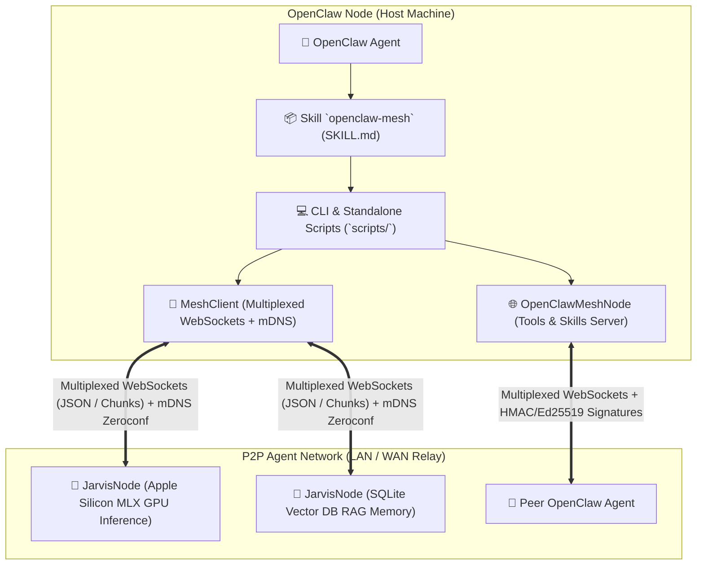

# 🌐 OpenClawMesh — Decentralized P2P AI Mesh Skill for OpenClaw

[🇬🇧 Read in English](README.md) | [🇫🇷 Lire en Français](README.fr.md) | [📜 Protocol Specification](references/PROTOCOL_SPEC.md) | [🔐 Security Model](references/SECURITY_MODEL.md)

[](LICENSE)
[](https://www.python.org/downloads/)
[](SKILL.md)
[](#-jarvismesh-interoperability)

**OpenClawMesh** is a modular Skill and lightweight peer-to-peer (P2P) networking framework designed for **OpenClaw** agents to autonomously discover, communicate with, and delegate tasks to distributed AI agents across local networks (LAN) and remote clusters, fully adhering to the **JarvisMesh 1.0 Wire Protocol**.

---

## 🏛️ System Architecture



---

## ✨ Key Features

1. **Automatic Zero-Configuration Discovery (mDNS)**:
   - Auto-discovers both JarvisMesh (`_jarvismesh._tcp.local.`) and OpenClaw (`_openclawmesh._tcp.local.`) nodes.
   - Dynamic introspection using the reserved `_describe_skills` skill.

2. **Universal Multi-Hardware AI Inference**:
   - **NVIDIA GPUs**: Native CUDA / TensorRT / PyTorch acceleration.
   - **AMD GPUs**: ROCm / DirectML / HIP GPU acceleration.
   - **Intel Core Ultra & Arc**: Intel NPU, OpenVINO, oneAPI and AVX-512 acceleration.
   - **Apple Silicon**: Ultra-fast Metal GPU inference via MLX-LM.
   - **Universal CPU & Local Fallback**: Dynamic routing (Ollama, llama.cpp, vLLM).
   - Hardware diagnostic CLI command: `openclaw-mesh hardware`.

3. **Real-Time Token-by-Token Streaming**:
   - Seamless token streaming using non-blocking `task_chunk` frames.

4. **Cryptographic Zero-Trust Security**:
   - **Pre-Shared Key (PSK)**: HMAC-SHA256 request authentication.
   - **Asymmetric Ed25519**: Public-key identity verification with replay protection via timestamps.

5. **Exposing Local OpenClaw Capabilities**:
   - Run a lightweight background node to expose OpenClaw agent tools to other nodes on the mesh.

6. **Monetization & Billing Gateway (Stripe / Revolut)**:
   - Turnkey API key store and billing gateway (`openclaw_mesh/gateway`).
   - Automated webhooks (Stripe / Lemon Squeezy) routing payouts to your **Revolut** IBAN.
   - Built-in Customer Web Portal (`/portal`) & Live API Playground.
   - See the [💳 Monetization Guide](MONETIZATION_GUIDE.md).

---

## 🚀 Installation & Setup

```bash
cd /Users/selim/Desktop/OpenClawMesh
pip install -e ".[dev]"
```

To install directly as an OpenClaw skill:
```bash
mkdir -p ~/.openclaw/skills
ln -s /Users/selim/Desktop/OpenClawMesh ~/.openclaw/skills/openclaw-mesh
```

---

## 💻 CLI Usage (`openclaw-mesh` / `scripts/mesh_cli.py`)

### 🔍 1. Discover Active Peers
```bash
python3 scripts/mesh_cli.py discover --inspect
```
Or structured JSON output:
```bash
python3 scripts/mesh_discover.py
```

### ⚡ 2. Delegate a Task
```bash
# Auto-route to best available node
python3 scripts/mesh_cli.py call --skill llm --payload '{"prompt": "Write a FastAPI server."}'

# Target a specific peer
python3 scripts/mesh_cli.py call --peer mac-m3 --skill memory_search --payload '{"query": "Metal GPU", "top_k": 3}'
```

### 🌊 3. Stream LLM Generation in Real Time
```bash
python3 scripts/mesh_cli.py stream --skill llm_stream --payload '{"prompt": "Explain P2P AI meshes."}'
```

### 🩺 4. Check Health and Latency
```bash
python3 scripts/mesh_cli.py ping --peer mac-m3
```

### 🌐 5. Run an OpenClaw Node on the Mesh
```bash
python3 scripts/mesh_cli.py serve --name openclaw-mac --port 8770
```

### 🔑 6. Generate Ed25519 Keypair
```bash
python3 scripts/mesh_cli.py keygen --out node_id.key
```

---

## 🧪 Testing

```bash
PYTHONPATH=. pytest -v tests/
```

---

## 📄 License
Distributed under the OpenClawMesh Commercial & Evaluation License. Free for evaluation and personal testing; commercial use and premium multi-hardware gateway access require an active license (Pro at €10/mo or Lifetime at €200). See [LICENSE](LICENSE) for full legal terms.
