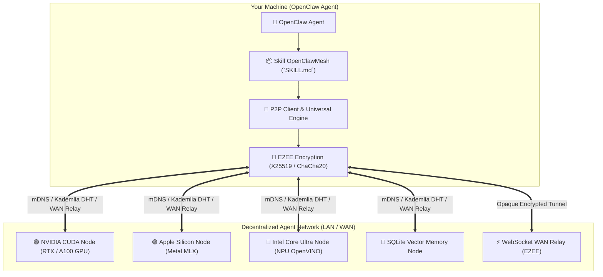

# 🌐 OpenClawMesh — Decentralized AI Agent Protocol & Universal Multi-Hardware Inference

[🇬🇧 Read in English](README.md) | [🇫🇷 Lire en Français](README.fr.md) | [📜 Protocol Specification](references/PROTOCOL_SPEC.md) | [📄 MIT License](LICENSE)

[](LICENSE)
[](https://www.python.org/downloads/)
[](SKILL.md)
[](#-jarvismesh-interoperability)
[](#-universal-hardware-acceleration)

**OpenClawMesh** is a sovereign peer-to-peer (P2P) networking framework and modular Skill designed for **OpenClaw** artificial intelligence agents.

It enables OpenClaw agents to autonomously discover peer nodes across local networks (LAN) and the wider Internet (WAN), delegate heavy computation, harness local GPU/NPU acceleration, route end-to-end encrypted (E2EE) payloads, and access shared persistent vector memory without relying on any centralized cloud provider.

---

## ✨ Key Features

1. 📡 **Dual-Layer Discovery: LAN mDNS & WAN Kademlia DHT (160-bit)**:
   - Instant zero-configuration local discovery using mDNS Zeroconf.
   - Large-scale global decentralized indexing via 160-bit **Kademlia DHT** with $k$-buckets ($k=20$).

2. ⚡ **Universal Multi-Hardware Acceleration & VRAM Auto-Quantization**:
   - 🟢 **NVIDIA GPUs**: Native CUDA / TensorRT / PyTorch acceleration.
   - 🔴 **AMD GPUs**: ROCm / DirectML / HIP GPU acceleration.
   - 🔵 **Intel Core Ultra & Arc**: Intel NPU, OpenVINO, oneAPI, and AVX-512 acceleration.
   - 🟣 **Apple Silicon (M1/M2/M3/M4)**: High-throughput Metal GPU inference via MLX-LM.
   - ⚪ **Universal CPU & Local Servers**: Optimized automatic fallback (Ollama, llama.cpp, vLLM).
   - **Smart VRAM Quantization**: Automatically picks the optimal format (4-bit, 8-bit, FP16) according to detected memory.

3. 🔀 **Pipeline Parallelism & Distributed MoE**:
   - Split and execute large LLM / MoE models across multiple mesh nodes sequentially.

4. 👁️ **Native Multi-Modal AI Suite**:
   - **Vision VLM**: Visual reasoning, OCR, and image analysis (Qwen2-VL, Pixtral).
   - **Speech-to-Text (STT)**: Multilingual Whisper audio transcription.
   - **Text-to-Speech (TTS)**: High-fidelity speech synthesis.

5. 🔐 **Zero-Trust Security & End-to-End Encryption (E2EE)**:
   - **ChaCha20-Poly1305 AEAD & X25519 ECDH** End-to-End Encryption: WAN relays never see plaintext data.
   - **Ed25519** cryptographic signatures, `TrustStore` whitelisting, and anti-replay timestamps.

6. 🌐 **NAT Traversal (STUN) & WebSocket WAN Relay**:
   - Public IP discovery and firewall traversal connecting nodes over the Internet.

---

## 🏛️ System Architecture



---

## 🚀 Quickstart Installation

```bash
# 1. Clone repository
git clone https://github.com/samajesteduroyaume/OpenClawMesh.git
cd OpenClawMesh

# 2. Install package and dependencies
pip install -e .

# 3. Link Skill to your OpenClaw directory
mkdir -p ~/.openclaw/skills
ln -s "$(pwd)" ~/.openclaw/skills/openclaw-mesh
```

---

## 💻 CLI Usage Guide

### 1. 🔍 Diagnose AI Hardware & VRAM
```bash
python3 scripts/mesh_cli.py hardware
```

### 2. 📡 Discover Active Mesh Peers
```bash
python3 scripts/mesh_cli.py discover --inspect
```

### 3. 💬 Delegate a Streaming Task
```bash
python3 scripts/mesh_cli.py stream --skill llm_stream --payload '{"prompt": "Explain quantum computing in 2 sentences."}'
```

### 4. 🗺️ Publish or Lookup Skills in Kademlia DHT
```bash
# Advertise skill in DHT
python3 scripts/mesh_cli.py dht --advertise llm

# Lookup skill provider endpoint
python3 scripts/mesh_cli.py dht --lookup llm
```

### 5. ⚡ Start a WebSocket WAN Relay (NAT Traversal)
```bash
python3 scripts/mesh_cli.py relay --port 8790
```

### 6. 👁️ Run Multi-Modal AI (Vision, STT, TTS)
```bash
# Vision VLM analysis
python3 scripts/mesh_cli.py multimodal --task vision --prompt "Describe this diagram."

# Text-to-Speech synthesis
python3 scripts/mesh_cli.py multimodal --task tts --prompt "Welcome to OpenClawMesh."
```

### 7. 🌐 Run an OpenClaw Node on the Mesh
```bash
python3 scripts/mesh_cli.py serve --name my-agent --port 8770
```

---

## 💳 Plans & Access Licenses

| Plan | Price | Mode | Description |
| :--- | :---: | :---: | :--- |
| 🆓 **Evaluation** | **€0** | Free | 3 daily test queries for evaluation and personal testing. |
| ⚡ **Pro Monthly** | **€10 / month** | Subscription | Unlimited queries, accelerated multi-hardware GPU/NPU inference. |
| 👑 **Lifetime License**| **€200** | **One-Time** | **Permanent unlimited access with no recurring subscription**, all future updates included, and VIP priority support. |

### Configuring Your Access Key:
```bash
export OPENCLAW_API_KEY="sk_claw_..."
```

---

## 🧪 Running Tests

```bash
PYTHONPATH=. pytest -v tests/
```
> Full suite of **35 automated unit & integration tests** covering P2P networking, Kademlia DHT, E2EE encryption, WAN relays, VRAM auto-quantization, and multi-modal engines.

---

## 📄 License

The OpenClawMesh client library and P2P protocol are released under the **MIT License**.
Access to managed high-performance inference clusters and official gateway relays is provided under commercial plans (**Pro at €10/mo** or **Lifetime at €200**).
- See [LICENSE](LICENSE) (English official) or [LICENSE.fr](LICENSE.fr) (French).
