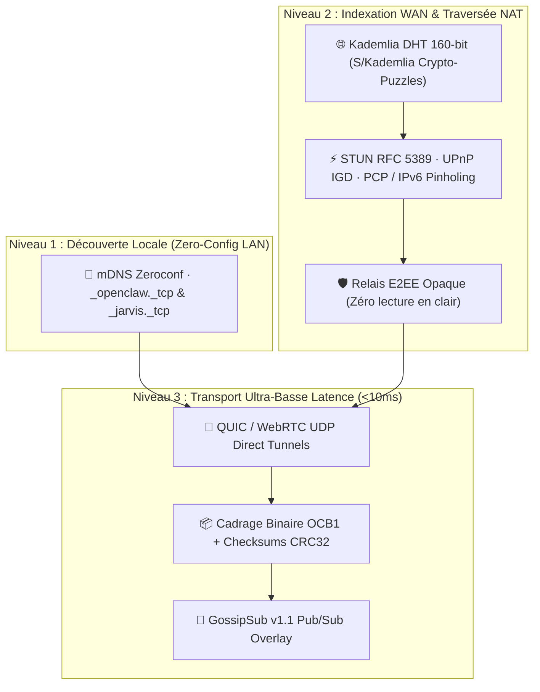
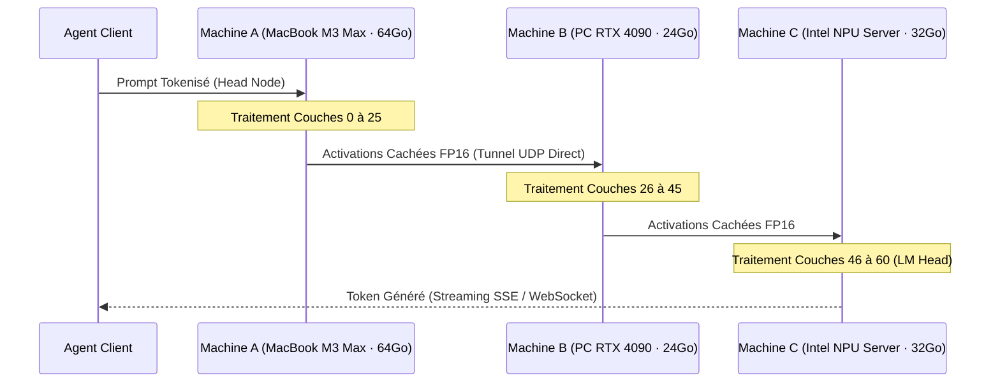

# 📜 LIVRE BLANC (WHITEPAPER) — OpenClawMesh v1.2.0

### Protocole Pair-à-Pair d'IA Souveraine, Inférence Distribuée Multi-Matériel & Économie de Calcul Décentralisée

**Date :** 2026  
**Auteurs :** Contributeurs & Architectes OpenClawMesh  
**Licence :** MIT (100% Gratuit, Open-Source & Souverain)  
**Classification :** Architecture Décentralisée, Cryptographie Post-Quantique, Inférence IA Hétérogène  

---

## 📑 Sommaire Exécutif

1. [Introduction & Constat](#1-introduction--constat)
2. [Philosophie & Principes Fondateurs](#2-philosophie--principes-fondateurs)
3. [Architecture Réseau & Topologie P2P](#3-architecture-réseau--topologie-p2p)
4. [Moteur d'Inférence Distribuée & Sharding Hétérogène](#4-moteur-dinférence-distribuée--sharding-hétérogène)
5. [Modèle de Sécurité Zero-Trust & Cryptographie Post-Quantique (PQC)](#5-modèle-de-sécurité-zero-trust--cryptographie-post-quantique-pqc)
6. [Consensus de Véracité & Proof-of-Inference (PoI)](#6-consensus-de-véracité--proof-of-inference-poi)
7. [Économie Souveraine de Calcul & Micro-Règlements](#7-économie-souveraine-de-calcul--micro-règlements)
8. [Multi-Modalité Temps Réel & Flux Continus (Voix <150ms & Vidéo 30 FPS)](#8-multi-modalité-temps-réel--flux-continus)
9. [Confidential Computing & Attestation Matérielle TEE](#9-confidential-computing--attestation-matérielle-tee)
10. [Écosystème Multi-Agents & Interopérabilité Universelle](#10-écosystème-multi-agents--interopérabilité-universelle)
11. [Comparatif Concurrentiel & Perspectives](#11-comparatif-concurrentiel--perspectives)

---

## 1. Introduction & Constat

L'essor fulgurant des modèles d'intelligence artificielle générative a conduit à une centralisation monopolistique extrême des infrastructures de calcul auprès d'un nombre restreint d'acteurs infonuagiques (*Hyperscalers*). Ce modèle centralisé soulève des risques structurels majeurs :

* **Perte de souveraineté et dépendance critique** : Dépendance vis-à-vis d'API propriétaires sujettes aux censures, pannes globales et variations tarifaires arbitraires.
* **Vulnérabilités de confidentialité des données** : Transmission de prompts, documents RAG confidentiels et code propriétaire vers des serveurs distants non vérifiables.
* **Sous-utilisation massive du matériel grand public et professionnel** : Des millions de puces puissantes (Apple Silicon Metal M1–M4, GPU NVIDIA RTX, cartes AMD ROCm, processeurs Intel Core Ultra avec NPU) demeurent inactives la majorité du temps sur les réseaux locaux d'entreprises et de particuliers.

**OpenClawMesh** a été conçu pour apporter une réponse définitive à cette centralisation en proposant un protocole pair-à-pair (P2P) universel, agnostique du matériel, 100% gratuit et doté d'une sécurité cryptographique post-quantique.

---

## 2. Philosophie & Principes Fondateurs

```
┌─────────────────────────────────────────────────────────────────────────────┐
│                            PRINCIPES OPENCLAWMESH                           │
├───────────────────────────────┬─────────────────────────────────────────────┤
│ 1. LAN-First & Zéro Cloud     │ Priorité absolue au réseau local sécurisé;   │
│                               │ aucun appel Internet sans accord explicite. │
├───────────────────────────────┼─────────────────────────────────────────────┤
│ 2. Agnosticisme Matériel Total│ Exploitation native CUDA, Metal, ROCm, NPU  │
│                               │ et CPU sans pilote propriétaire obligatoire.│
├───────────────────────────────┼─────────────────────────────────────────────┤
│ 3. Confidentialité Post-      │ Chiffrement hybride résistant aux futurs    │
│    Quantique (PQC)            │ calculateurs quantiques (ML-KEM-768).       │
├───────────────────────────────┼─────────────────────────────────────────────┤
│ 4. Découpage Hétérogène       │ Exécution de modèles 70B à 671B par         │
│                               │ parallélisme de pipeline multi-machines.    │
├───────────────────────────────┼─────────────────────────────────────────────┤
│ 5. Troc Équitable de Calcul   │ Registre décentralisé récompensant le       │
│                               │ partage de VRAM et de temps GPU/NPU.        │
└───────────────────────────────┴─────────────────────────────────────────────┘
```

---

## 3. Architecture Réseau & Topologie P2P

OpenClawMesh s'articule autour d'une architecture réseau multi-couches garantissant une connectivité ultra-fluide du réseau local d'entreprise jusqu'aux maillages étendus (WAN) :



### 3.1 Cadrage Binaire Haute Vitesse (`OCB1`)
Pour éliminer le surcoût de parsing JSON lors de streaming à plus de 150 tokens/seconde, OpenClawMesh implémente le standard binaire compact **`OCB1`** :
* **En-tête fixe (16 octets)** : Magic (`4B`) | Type (`1B`) | Flags (`1B`) | Séquence (`2B`) | Longueur (`4B`) | CRC32 (`4B`).
* **Charge utile zérocopie** : Réduction de 65% de l'empreinte réseau et accélération du débit d'échange des buffers de tenseurs.

---

## 4. Moteur d'Inférence Distribuée & Sharding Hétérogène

### 4.1 Parallélisme de Pipeline Multi-Machines (70B à 671B)
OpenClawMesh permet de regrouper la mémoire VRAM de multiples ordinateurs pour exécuter des modèles massifs sans supercalculateur centralisé :

$$\text{Allocation}(N_i) = \max\left(1, \left\lfloor \frac{\text{VRAM}_i \cdot W_{\text{accel}}}{\sum_{j} \text{VRAM}_j \cdot W_j} \cdot L_{\text{total}} \right\rfloor\right)$$



### 4.2 Speculative Decoding Distribué (Draft Local $\rightarrow$ Cible Distant)
Un petit modèle ultra-léger (1B/3B) exécuté sur le NPU ou le processeur local génère une grappe de $\gamma$ tokens candidats en parallèle. Le nœud GPU distant vérifie l'ensemble de la séquence en un seul appel de calcul matriciel, générant un facteur d'accélération de **2.2x à 3.1x**.

---

## 5. Modèle de Sécurité Zero-Trust & Cryptographie Post-Quantique (PQC)

OpenClawMesh intègre un chiffrement de niveau militaire protégeant les flux contre les attaques actuelles et futures (*"Harvest Now, Decrypt Later"*) :

* **Échange de Clés Hybride PQC** : Combinaison de **X25519 (Courbe Elliptique)** et **ML-KEM-768 / Kyber (Réseaux Euclidiens)** standardisé FIPS 203.
* **Double Ratchet & Perfect Forward Secrecy (PFS)** : Rotation continue des clés éphémères de session.
* **Chiffrement Authentifié AEAD** : ChaCha20-Poly1305 pour toutes les données en transit.
* **Identités Cryptographiques Uniques** : Paires de clés asymétriques Ed25519 par nœud associées à un TrustStore d'autorisation stricte.

$$\text{SharedSecret} = \text{HKDF-SHA256}\left(\text{ECDH}(X_{25519}) \parallel \text{Decaps}(KEM_{\text{Kyber-768}})\right)$$

---

## 6. Consensus de Véracité & Proof-of-Inference (PoI)

Pour contrer les nœuds corrompus, menteurs ou empoisonnés sans recalculer 100% des requêtes :
1. **Attestation Cryptographique d'Inférence** : Chaque réponse est signée avec le hash SHA-256 du prompt, de la réponse et l'horodatage.
2. **Contrôle d'Entropie de Shannon** :
   $$H(X) = -\sum_{i=1}^{n} P(x_i) \log_2 P(x_i)$$
   Rejet immédiat des sorties répétitives anormales (boucles de spam ou hallucination forcée).
3. **Slashing Automatique de Réputation** : Dégradation exponentielle du score de réputation et éviction du maillage en cas d'altération détectée.

---

## 7. Économie Souveraine de Calcul & Micro-Règlements

OpenClawMesh intègre un système d'équilibre de calcul décentralisé :
* **Registre de Crédits de Calcul (`PeerComputeCreditLedger`)** : Comptabilisation transparente basée sur le troc de tokens servis ($0.5\text{ crédit} / 1000\text{ tokens}$).
* **Reçus de Calcul Infalsifiables (`ComputeReceipt`)** : Preuve signée de travail fourni.
* **Règlement Décentralisé Optionnel** : Ancrage et paiement de lots de reçus via des factures **Bitcoin Lightning Network (BOLT-11)** ou canaux de micro-état Layer 2.

---

## 8. Multi-Modalité Temps Réel & Flux Continus

* **Voix Temps Réel (<150ms)** : Pipeline streaming direct reliant l'audio micro au STT Whisper optimisé, streaming de tokens LLM et synthèse vocale continue (TTS) par blocs de phrases.
* **Vision Continue (30 FPS)** : Ingestion vidéo en direct, détection d'images clés (*Keyframe Semantic Pooling*) et indexation d'embeddings visuels pour le RAG vidéo et la robotique.

---

## 9. Confidential Computing & Attestation Matérielle TEE

Le protocole interagit directement avec les enclaves matérielles :
* **Apple Silicon Secure Enclave** : Signature matérielle protégée par le processeur sécurisé d'Apple.
* **AMD SEV-SNP & Intel TDX / SGX** : Mesures cryptographiques de l'enclave (*PCR digest*) certifiant qu'aucun administrateur du système hôte ne peut espionner la mémoire vive de l'inférence.

---

## 10. Écosystème Multi-Agents & Interopérabilité Universelle

OpenClawMesh s'intègre nativement comme passerelle transparente pour tous les frameworks d'agents :

```
                        ┌──────────────────────────────┐
                        │      ÉCOSYSTÈME D'AGENTS     │
                        ├──────────────┬───────────────┤
                        │   CrewAI     │  LangGraph    │
                        │   AutoGen    │  LangChain    │
                        │   LlamaIndex │  OpenClaw     │
                        └──────┬───────┴───────┬───────┘
                               │               │
                               ▼               ▼
┌─────────────────────────────────────────────────────────────────────────────┐
│                 PASSERELLE UNIVERSELLE OPENCLAWMESH                         │
├──────────────────────┬──────────────────────┬───────────────────────────────┤
│ API OpenAI Standard  │ API Anthropic Claude │ API Ollama Native             │
│ /v1/chat/completions │ /v1/messages         │ /api/generate & /api/chat     │
│ /v1/embeddings       │                      │                               │
│ /v1/audio/transcribe │                      │                               │
├──────────────────────┴──────────────────────┴───────────────────────────────┤
│ Serveur MCP (Model Context Protocol) — Transports Stdio & SSE (/mcp/sse)     │
│ Prometheus Exporter (/metrics) & Dashboard Cyberpunk 3D WebGL               │
└─────────────────────────────────────────────────────────────────────────────┘
```

---

## 11. Comparatif Concurrentiel & Perspectives

| Caractéristique | Cloud Centralisé (OpenAI / AWS) | Réseaux P2P Génériques | **OpenClawMesh v1.2.0** |
| :--- | :---: | :---: | :---: |
| **Coût d'accès** | Payant (Abonnement / Token) | Variable / Crypto-gaz | **100% Gratuit & Souverain** |
| **Confidentialité** | Serveurs tiers distants | Variable | **E2EE + PQC Hybride + TEE** |
| **Réseau Local (LAN)** | ❌ Inopérant sans Internet | ❌ Nécessite bootstrap WAN | **✅ LAN-First Zero-Config** |
| **Sharding 70B+** | Serveurs Cloud dédiés | ⚠️ Complexe | **✅ Pipeline Multi-Machines** |
| **Voix Temps Réel** | Propriétaire Cloud | ❌ Non supporté | **✅ Voice-to-Voice <150ms** |
| **Compatibilité API** | Format unique propriétaire | Custom wire format | **OpenAI + Anthropic + Ollama + MCP** |

---

## 🏁 Conclusion

**OpenClawMesh** établit le nouveau standard de l'intelligence artificielle décentralisée et souveraine : rapide, inviolable, universellement interopérable et accessible à tous sans barrière technique ni financière.
